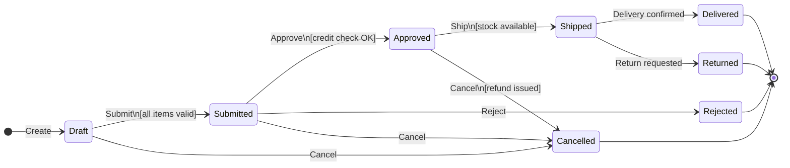
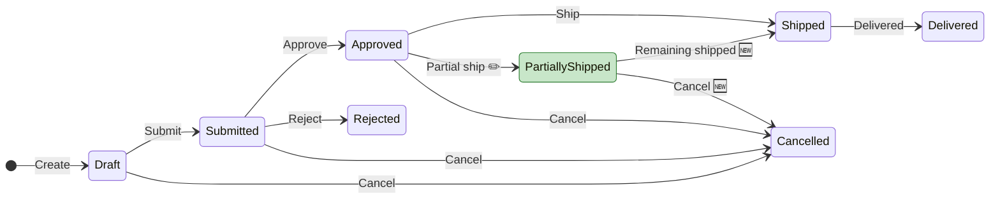

# Generate State Diagram

Create accurate Mermaid state diagrams from codebase analysis — visualize the lifecycle of any entity with status/state fields.

## When to Use

- Documenting entity lifecycle (e.g., Order: DRAFT → SUBMITTED → APPROVED → SHIPPED)
- Visualizing status transitions for a Spec or PBI
- Understanding all possible state paths before making changes
- Creating to-be diagrams showing proposed new states or transitions
- Reviewing state machine correctness (missing transitions, dead states)
- Keywords: "state diagram", "status flow", "entity lifecycle", "state machine", "status transitions"

## Workflow

### Step 1: Identify the Entity and Status Field

Find the entity whose lifecycle to diagram:

**Detection strategies by stack:**

| Stack | Where to Find Status |
|-------|---------------------|
| Java / Jakarta EE | `@Entity` class with `@Enumerated` status field; enum class with status values |
| Java / Spring Boot | Same + `@StateMachine` config if Spring Statemachine used |
| .NET / EF Core | Entity class with enum property; `SmartEnum` or custom state types |
| Python / Django | Model with `CharField(choices=...)` or `django-fsm` `FSMField` |
| Python / FastAPI | SQLAlchemy model with `Enum` column type |
| TypeScript / React | Type unions (`type Status = 'draft' \| 'active' \| 'closed'`); Redux state slices |
| PHP / Laravel | Model with enum cast; `spatie/laravel-model-states` |
| Android / Kotlin | Sealed class/interface or enum class for UI/domain states |
| iOS / Swift | Enum with associated values for state |

**Search patterns:**
```
1. Grep for: enum.*Status, enum.*State, status.*Enum, state.*Enum
2. Grep for: @Enumerated, FSMField, choices=, sealed class.*State
3. Read entity/model classes → find status/state fields
4. Read the enum/type → list all possible values
```

### Step 2: Trace All Transitions

For each status value, find where transitions happen:

```
1. Grep for: setStatus, status =, .transition(, .changeState(
2. Read each service/handler method that modifies status
3. For each transition, record:
   - FROM state
   - TO state
   - TRIGGER (what action causes it: API call, timer, event, user action)
   - GUARD (what condition must be true: validation, business rule)
   - SIDE EFFECT (what else happens: email sent, event published, audit logged)
```

**Build a transition table:**

| # | From | To | Trigger | Guard | Side Effects |
|---|------|----|---------|-------|-------------|
| 1 | `[none]` | DRAFT | Create order | — | Audit log |
| 2 | DRAFT | SUBMITTED | Submit action | All items validated | Notification sent |
| 3 | SUBMITTED | APPROVED | Manager approve | Credit check passed | Payment initiated |
| 4 | SUBMITTED | REJECTED | Manager reject | — | Requester notified |
| 5 | APPROVED | SHIPPED | Warehouse confirm | Stock available | Tracking created |
| 6 | * | CANCELLED | Cancel action | Not yet SHIPPED | Refund if paid |

### Step 3: Detect Guards and Side Effects

Read the transition methods to find:

**Guards (conditions that must be true):**
- `if` / `switch` statements before status change
- Validation methods called before transition
- `@PreUpdate` / `@PrePersist` checks
- Business rule methods (e.g., `canApprove()`, `isEligibleForShipment()`)

**Side Effects (what happens on transition):**
- Event publishing (`@Observes`, `ApplicationEventPublisher`, signals)
- Notifications (email, SMS, push)
- Audit logging
- Other entity updates (cascading state changes)
- External API calls
- Timer/scheduler setup

### Step 4: Identify Dead States and Missing Transitions

Analyze the transition table for issues:

| Issue Type | How to Detect |
|-----------|---------------|
| **Dead state** | A state that can be entered but never exited (no outgoing transition) |
| **Unreachable state** | A state defined in enum but no incoming transition exists |
| **Missing error path** | No transition to ERROR/FAILED state from states that involve external calls |
| **No terminal state** | No state is clearly "final" (COMPLETED, CANCELLED, ARCHIVED) |
| **Ambiguous transition** | Same FROM + TRIGGER leads to multiple TO states without clear guard |

Flag these in the output with ⚠️ markers.

### Step 5: Create Mermaid State Diagram

Use `stateDiagram-v2` syntax:



**Mermaid conventions:**
- `[*]` for start and end pseudo-states
- `direction LR` for left-to-right (use `TB` for top-to-bottom if many states)
- Transition labels: `Action\n[guard condition]`
- Use `state "Display Name" as alias` for long state names
- Use `note right of StateName` for important side effects
- Use `--` for composite states (nested state machines)

### Step 6: Mark Changes (To-Be Diagrams Only)

When creating to-be diagrams, use Mermaid `classDef` for visual markers:



| Marker | Style | Meaning |
|--------|-------|---------|
| 🆕 | `classDef newState fill:#c8e6c9` green | New state or transition |
| ✏️ | `classDef modifiedState fill:#fff9c4` yellow | Modified transition (guard/effect changed) |
| ❌ | `classDef removedState fill:#ffcdd2` red | Removed state or transition |

### Step 7: Output Format

Produce markdown with:

```markdown
## State Diagram: [Entity Name] Lifecycle

### Entity Details
- **Entity**: `com.example.order.entity.Order`
- **Status Field**: `orderStatus` (`@Enumerated(EnumType.STRING)`)
- **Enum**: `com.example.order.entity.OrderStatus`
- **States**: [count] defined, [count] reachable

### States

| State | Description | Terminal? | Entry Count |
|-------|-------------|-----------|------------|
| DRAFT | Initial state on creation | No | — |
| SUBMITTED | Awaiting approval | No | From DRAFT |
| APPROVED | Approved, ready for fulfillment | No | From SUBMITTED |
| SHIPPED | In transit | No | From APPROVED |
| DELIVERED | Successfully received | Yes | From SHIPPED |
| CANCELLED | Cancelled at any point | Yes | From DRAFT, SUBMITTED, APPROVED |
| REJECTED | Rejected by approver | Yes | From SUBMITTED |

### Transition Table

| # | From | To | Trigger | Guard | Side Effects | Code Location |
|---|------|----|---------|-------|-------------|---------------|
| 1 | — | DRAFT | createOrder() | — | Audit log | OrderService:45 |
| 2 | DRAFT | SUBMITTED | submitOrder() | Items validated | Notification | OrderService:78 |
| ... | | | | | | |

### State Diagram

[Mermaid diagram here]

### Issues Found
- ⚠️ [description of any dead states, missing transitions, etc.]

### Change Summary (To-Be only)

| # | Change | Type | Rationale |
|---|--------|------|-----------|
| 1 | Added PARTIALLY_SHIPPED state | 🆕 New | Support partial fulfillment |
| 2 | Modified APPROVED → SHIPPED guard | ✏️ Modified | Added stock check |
```

## Multi-Entity State Diagrams

For features involving multiple entities with interdependent states:

1. Create individual state diagrams for each entity
2. Add a **Cross-Entity State Dependency** section:

```markdown
### Cross-Entity Dependencies

| Entity A State | Triggers | Entity B State Change |
|---------------|----------|----------------------|
| Order.APPROVED | → | Payment.INITIATED |
| Payment.COMPLETED | → | Order.READY_FOR_SHIPMENT |
| Shipment.DELIVERED | → | Order.DELIVERED |
```

## Validation

- [ ] All enum/type values are represented as states
- [ ] All transitions traced from actual code (not assumed)
- [ ] Guards and side effects sourced from service/validator code
- [ ] Dead states and unreachable states flagged
- [ ] Terminal states clearly identified
- [ ] Diagram renders correctly in Mermaid
- [ ] Code locations referenced for each transition
- [ ] To-be changes clearly marked with 🆕/✏️/❌
