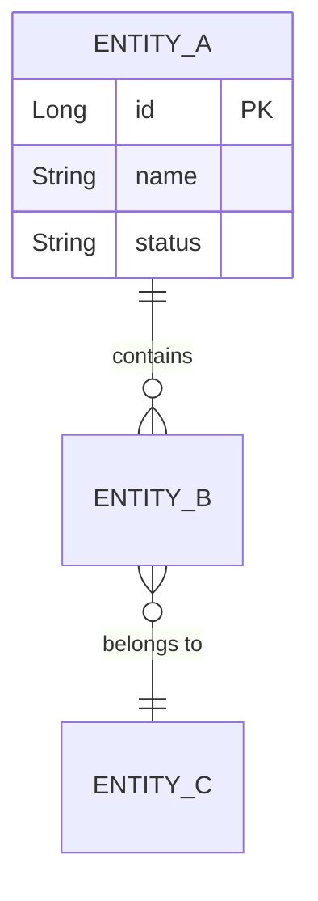

# Learn Codebase — Business & Workflow Deep Dive

Step-by-step workflow for helping developers understand existing codebases from both a business and technical perspective.

## When to Use

- New team member onboarding
- Understanding a specific business domain
- Preparing to work on an unfamiliar feature
- Keywords: "explain this codebase", "help me understand", "onboard me", "learn the system"

## Workflow

### Step 1: Ask What the Developer Wants to Learn

Ask (max 3 questions):

1. **Goal**: General onboarding / specific domain / specific workflow / prepare for a task
2. **Depth**: Overview (10 min) / Working knowledge (30 min) / Deep dive (thorough)
3. **Focus area**: (optional — skip if they said "everything")

Default to **Working knowledge** if unspecified.

### Step 2: Discover Business Domains

Scan the codebase to identify domains:

- **Package/directory structure** — look for domain-based organization
- **Entity/Model classes** — core business concepts
- **Service classes** — business logic and rules
- **REST endpoints / Controllers** — system's external API
- **Database schemas / migrations** — data model
- **README, docs/, config** — existing documentation and feature flags

Output a **Domain Map** table:

| Domain | What It Does | Key Entities | Key Services |
|--------|-------------|--------------|--------------|
| [name] | [purpose] | [entities] | [services] |

### Step 3: Trace Business Workflows

For each major workflow:

1. Find the entry point (REST endpoint, message listener, scheduled job)
2. Trace the call chain: Controller → Service → Repository → Database
3. Identify business rules, validations, calculations, state transitions
4. Note integrations (external API calls, message publishing, notifications)
5. Document error scenarios and how they're handled

Output format per workflow:

```markdown
### 🔄 Workflow: [Name]

**Trigger**: [HTTP method + path or event]
**Business Purpose**: [1-2 sentences]

**Flow**:
1. `[Class.method()]` — [what it does]
2. `[Class.method()]` — [what it does]

**Business Rules**: [bullet list]
**Error Scenarios**: [bullet list]
**Data Changes**: [INSERT/UPDATE/DELETE list]
```

### Step 4: Document Business Rules

Extract from service classes, validators, entities, config:

| # | Rule | Where Enforced | Code Location |
|---|------|---------------|---------------|
| 1 | [rule] | [layer/class] | [file:line] |

### Step 5: Explain Entity Relationships

Generate a **Mermaid ER diagram** showing relationships:



Then explain each key entity:

```markdown
### Key Entity: [Name]
| Field | Type | Business Meaning |
|-------|------|-----------------|
| [field] | [type] | [meaning] |

**State Transitions**: [if applicable]
DRAFT → SUBMITTED → APPROVED → SHIPPED → COMPLETED
```

### Step 6: Generate Sequence Diagrams

For each major workflow, produce a **Mermaid sequence diagram**:
- Use actual class names and method names from the code
- Include ALL layers: Client → Controller → Service → Repository → DB
- Show external calls, async operations, error paths
- Use `activate`/`deactivate`, `alt`/`else`, `opt`, `par` as needed

### Step 7: Map External Integrations

| System | Purpose | Protocol | Direction | Error Handling | Code Location |
|--------|---------|----------|-----------|---------------|---------------|
| [name] | [why] | [REST/JMS/etc] | [In/Out/Both] | [retry/circuit breaker] | [file:line] |

### Step 8: Save Report as Markdown File

**CRITICAL: Save the learning output as a markdown file**, not just chat output.

File path: `docs/exploration/[domain-or-feature]-overview.md`

The saved file MUST include:
- Domain map table
- Entity relationship diagram (Mermaid ER)
- Sequence diagrams for major workflows
- Business rules table with code locations
- External integrations map
- Non-obvious behaviors / gotchas

### Step 9: Provide Interactive Learning Path

Offer next steps:
1. Deep dive into a specific domain
2. Trace a specific flow
3. Understand a specific file/class
4. See additional sequence diagrams
5. Start working on a task

## Presentation Guidelines

- **Business first, code second** — explain WHAT before WHERE
- **Use tables and Mermaid diagrams** — visual > paragraphs
- **Include real code references** — file names, line numbers
- **Explain WHY, not just WHAT** — business justification for design choices
- **Highlight gotchas** — non-obvious behavior, hidden side-effects, tech debt
- **Group by business domain** — not by technical layer
- **Use the codebase's own terminology** — don't rename concepts
- **Always save as file** — exploration output is reusable team knowledge
