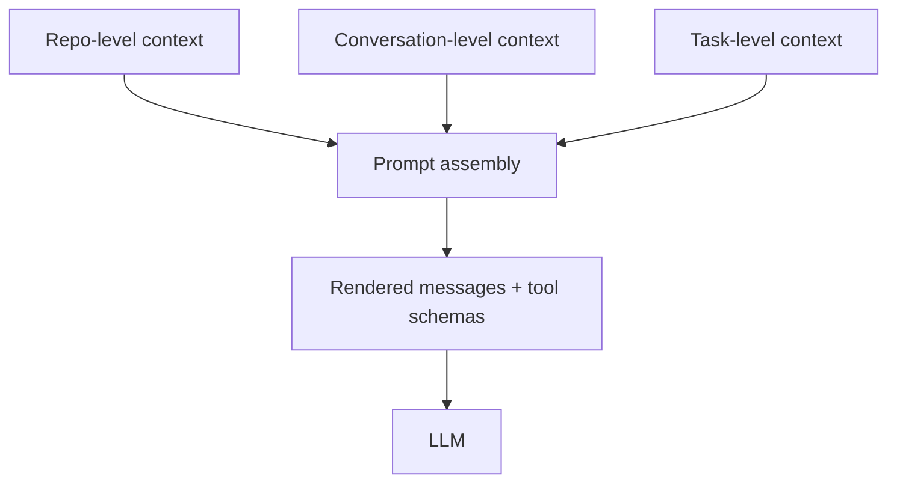

# Context Optimization Playbook for VS Code Copilot Chat

## 1. Mục tiêu của playbook này

Tài liệu này tập trung vào một câu hỏi duy nhất:

> Làm sao để đưa đúng context cho VS Code Copilot Chat để agent hiểu nhanh, chọn tool đúng, ít đi sai hướng, và tạo ra output ổn định hơn?

Nó không cố mô tả toàn bộ runtime nội bộ của extension.

Nếu cần bản deep dive kiến trúc đầy đủ, xem:

- [copilot-chat-extension-deep-dive.md](/d:/Personal/Projects/vscode-copilot-chat/docs/copilot-chat-extension-deep-dive.md)

---

## 2. Ý tưởng cốt lõi

Tối ưu context không phải là:

- nhét càng nhiều càng tốt
- hay nhét càng ít càng tốt

Tối ưu context là:

- đưa đúng dữ liệu
- ở đúng lớp
- vào đúng thời điểm

Ba câu hỏi phải luôn giữ trong đầu:

1. Context này giúp model quyết định đúng hơn ở chỗ nào?
2. Context này có phải source-of-truth không?
3. Nếu không đưa, agent có tự tìm ra dễ không?

---

## 3. Mental model: context đi qua 3 lớp



### 3.1 Repo-level context

Là thứ nên tồn tại lâu dài:

- `.github/copilot-instructions.md`
- `.instructions.md`
- `.agent.md`
- `SKILL.md`
- docs kiến trúc
- docs source-of-truth
- docs verification

### 3.2 Conversation-level context

Là thứ tích lũy theo thread:

- history
- summaries/compaction
- tool transcript
- interim decisions

### 3.3 Task-level context

Là thứ chỉ đúng cho yêu cầu hiện tại:

- outcome
- repro
- stack trace
- file anchor
- constraints
- verify steps

---

## 4. Context mạnh là context kiểu gì

### 4.1 Context mạnh

- stack trace thật
- lỗi biên dịch thật
- test đang fail
- command verify rõ ràng
- file source-of-truth
- acceptance criteria ngắn và đo được
- kiến trúc/convention đã được thống nhất

### 4.2 Context yếu

- "chắc là liên quan file này"
- note cũ không còn đúng
- brainstorm chưa chốt
- dump 15 file mà không có thứ tự ưu tiên
- yêu cầu "sửa giúp" nhưng không nói expected behavior

---

## 5. Cách nghĩ theo signal / noise / cost

Mỗi mẩu context đều có:

- signal: giúp agent quyết định đúng hơn
- noise: làm agent phân tâm
- cost: token, thời gian đọc, thời gian reasoning

Quy tắc đơn giản:

- signal cao, cost thấp -> đưa ngay
- signal cao, cost cao -> đưa có chọn lọc hoặc đưa path
- signal thấp, cost cao -> thường bỏ

### 5.1 Ví dụ

| Context | Signal | Cost | Nên làm |
|---|---|---|---|
| Stack trace 20 dòng | Cao | Thấp | Paste trực tiếp |
| File architecture 800 dòng | Trung bình | Cao | Chỉ trích phần liên quan hoặc mention path |
| 12 file "có thể liên quan" | Thấp | Cao | Không dump |
| Test command đúng | Cao | Thấp | Paste trực tiếp |
| Convention lặp lại mọi task | Cao | Trung bình | Chuyển vào instruction file |

---

## 6. Context nên được đặt ở đâu

### 6.1 Đặt trong prompt hiện tại khi

- chỉ áp dụng cho task này
- là repro/bug cụ thể
- là expected output cụ thể
- là temporary constraint

### 6.2 Đặt vào common doc khi

- nhiều người phải giải thích đi giải thích lại
- agent hay hiểu sai cùng một subsystem
- onboarding chậm vì thiếu source-of-truth
- review liên tục bắt cùng một lỗi

### 6.3 Đặt vào instruction file khi

- là rule bền vững
- là style/convention/quy trình lặp lại
- gần như task nào cũng cần tuân thủ

### 6.4 Đặt vào skill khi

- workflow có nhiều bước lặp
- cần instruction + assets + references theo gói
- muốn agent follow playbook chuyên biệt

---

## 7. Prompt shape nên như thế nào

Một prompt thực dụng, mạnh, và dễ cho agent thường có hình dạng:

```text
Goal:
Fix/implement <outcome>.

Anchor:
Start with <file/module>.

Constraints:
Do not change <x>.
Keep <y> behavior.

Verify:
Run/check <command or behavior>.
```

Nếu task mơ hồ:

```text
Investigate root cause first.
If clear, implement the smallest safe fix.
State assumptions if you need to choose between options.
Verify with ...
```

---

## 8. Khi nào nên attach file, khi nào chỉ đưa path

### 8.1 Nên attach/paste

- error output ngắn
- test failure ngắn
- stack trace
- acceptance criteria
- snippet nhỏ là source-of-truth

### 8.2 Nên chỉ mention path

- file dài
- module lớn mà agent có thể tự đọc
- docs kiến trúc dài
- thư mục cần agent tự khám phá

### 8.3 Heuristic

- nếu người đọc cần từng dòng ngay lập tức -> paste
- nếu chỉ cần chỗ bắt đầu nghiên cứu -> path

---

## 9. Thread strategy

Đừng tổ chức thread theo kiểu:

- "hôm nay làm gì thì nhét hết vào một chỗ"

Nên tổ chức theo:

- feature
- subsystem
- bug investigation line

Lý do:

- compaction/summarization giữ chất lượng hơn khi thread cùng chủ đề
- tool transcript và decisions cũ vẫn còn giá trị
- agent ít bị kéo sang context không liên quan

### 9.1 Rule thực dụng

- cùng feature/subproblem -> giữ cùng thread
- khác domain rõ rệt -> mở thread mới

---

## 10. Plan mode và decision log nên dùng lúc nào

Không nên bật plan mode cho mọi việc.

Plan mode hoặc markdown decision log hợp khi:

- task lớn
- cần chia pha
- còn nhiều ẩn số
- nhiều người/agent cùng phối hợp
- cần lưu decisions để sau này explain lại

Không cần thiết khi:

- bug rõ
- patch nhỏ
- yêu cầu đã rất cụ thể

---

## 11. Cách xây "repo memory"

Nếu cùng một chỉ dẫn phải nhắc lại nhiều lần, đừng tiếp tục nhắc tay trong prompt.

Hãy chuyển nó sang một trong các lớp bền hơn:

1. `copilot-instructions.md`
2. `.instructions.md`
3. docs trong `docs/`
4. skill
5. custom agent

### 11.1 Dấu hiệu nên nâng cấp thành repo memory

- prompt nào cũng phải nhắc
- engineer mới luôn hỏi cùng một câu
- agent hay lặp cùng một lỗi
- review cứ bắt cùng một pattern

---

## 12. Common doc nên có cấu trúc gì

```md
# <Topic>

## Purpose

## Source of Truth
- files/modules

## Request / Data Flow
1.
2.
3.

## Key Constraints
- Do
- Don't

## Verification
- Commands
- Manual checks

## Common Failure Modes
- ...

## Related Files
- ...
```

Đây là format tốt vì dùng được cho:

- engineer
- reviewer
- LLM agent

---

## 13. Gợi ý cụ thể cho team dùng VS Code Copilot Chat hiệu quả hơn

### 13.1 Với task implement/fix

- nói outcome trước
- chỉ 1-2 anchor files
- nêu non-goals
- nêu verify command

### 13.2 Với task explain/research

- nói rõ muốn trace end-to-end hay chỉ một phần
- nói rõ muốn đọc code hay chỉ summary
- yêu cầu chỉ ra file source-of-truth

### 13.3 Với task refactor

- nói rõ behavior phải giữ nguyên
- nói rõ public API có được đổi không
- nói rõ mức độ patch mong muốn: minimal hay broader cleanup

### 13.4 Với task review

- yêu cầu focus vào bug/risk/regression
- cung cấp commit/range/files
- nói rõ có muốn review test coverage không

---

## 14. Examples: tốt và chưa tốt

### 14.1 Chưa tốt

```text
Fix chat please. I think many files are related:
agentPrompt.tsx
toolCallingLoop.ts
chatParticipantRequestHandler.ts
...
```

Vấn đề:

- không rõ outcome
- không rõ bug
- không rõ file anchor chính
- không rõ verify

### 14.2 Tốt hơn

```text
Investigate why tool results in agent mode are repeated across turns.
Start with src/extension/intents/node/toolCallingLoop.ts and src/extension/prompts/node/agent/agentPrompt.tsx.
Keep existing user-facing behavior unchanged unless duplication is clearly a bug.
Verify by explaining root cause and, if fixed, by describing the affected prompt/tool round flow.
```

### 14.3 Tốt cho giải thích kiến trúc

```text
Explain how a chat request becomes the final LLM request in agent mode.
Trace the flow from ChatParticipantRequestHandler through ToolCallingLoop and AgentPrompt.
Call out where custom instructions, tool schemas, history summarization, and .github instruction files enter the pipeline.
```

---

## 15. Checklist trước khi gửi prompt

1. Outcome đã rõ chưa?
2. File/module anchor đã rõ chưa?
3. Constraint đã rõ chưa?
4. Verify đã rõ chưa?
5. Có đang dump quá nhiều file không?
6. Có cái gì nên đưa vào common doc thay vì nhắc lại không?
7. Thread hiện tại còn cùng chủ đề không?

---

## 16. Checklist cho repo muốn "agent-friendly"

1. Có `copilot-instructions.md` ngắn, rõ, không mâu thuẫn.
2. Có docs kiến trúc theo subsystem.
3. Có docs source-of-truth map.
4. Có docs verification/test commands.
5. Có docs common debugging playbooks.
6. Có skills/prompts cho workflow lặp lại.
7. Có naming và cấu trúc thư mục nhất quán.

---

## 17. Một câu kết rất ngắn để dùng trong training nội bộ

> Context tốt không phải là context nhiều.
> Context tốt là context giúp agent quyết định đúng nhanh hơn, verify dễ hơn, và ít phải đoán hơn.
