# VS Code Copilot Chat Extension Deep Dive

## Mục tiêu tài liệu

Tài liệu này ghi lại chi tiết cách extension `vscode-copilot-chat` hoạt động:

- Từ lúc nhận input của user
- Qua các bước chọn participant, intent, prompt, tool
- Cho đến lúc trả lời final response
- Đồng thời giải thích cách các file trong `.github/` được áp dụng
- Và rút ra các nguyên tắc thực tế để quản lý context tốt hơn

Tài liệu này dựa trên code thực tế trong repo hiện tại, không phải mô tả khái niệm chung chung.

---

## 1. Tổng quan kiến trúc

Ở mức cao nhất, extension hoạt động như một pipeline nhiều lớp:

1. Extension activation
2. Service registration và contribution loading
3. Chat participant nhận request
4. Request handler dựng conversation state
5. Intent được chọn
6. Intent dựng prompt và danh sách tools hợp lệ
7. Tool-calling loop chạy model
8. Model có thể gọi tool nhiều vòng
9. Tool result được đưa lại vào prompt
10. Khi đủ điều kiện thì kết thúc và trả response cho user

### Sơ đồ tổng thể

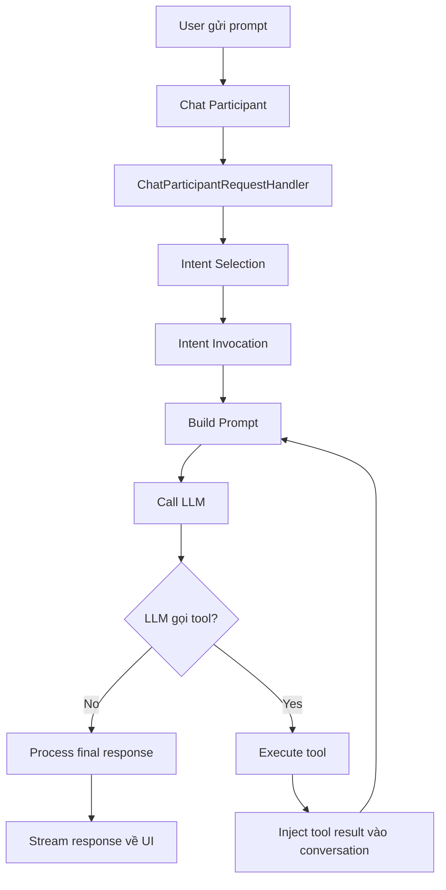

---

## 2. Entry point và activation

### 2.1 Node entrypoint

Node extension host bắt đầu ở:

- `src/extension/extension/vscode-node/extension.ts`

Nó chỉ là wrapper gọi `baseActivate(...)`.

### 2.2 Base activation

Logic activate dùng chung nằm ở:

- `src/extension/extension/vscode/extension.ts`

Ở đây có các việc chính:

1. Chặn activate trong vài tình huống test
2. Kiểm tra stable/pre-release compatibility
3. Nạp l10n
4. Nạp package dev helpers nếu không phải production
5. Tạo `InstantiationService`
6. Register services
7. Tạo `ContributionCollection`
8. `waitForActivationBlockers()`

### 2.3 Ý nghĩa

Điểm này rất quan trọng:

- Repo này không phải kiểu “một file main điều khiển tất cả”
- Nó dùng DI + contributions rất nặng
- Tức là feature được cắm vào runtime qua service registration và contribution factories

### 2.4 Sơ đồ activation

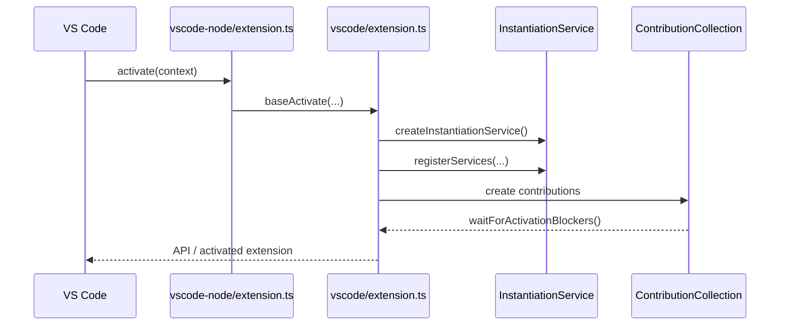

---

## 3. Service registration và contributions

### 3.1 Service registration

Service registration ở:

- `src/extension/extension/vscode-node/services.ts`

File này define hầu hết service quan trọng:

- `IToolsService`
- `IChatAgentService`
- `IIntentService`
- `IChatHookService`
- `ISessionTranscriptService`
- `IChatMLFetcher`
- `IWorkspaceChunkSearchService`
- `ILanguageContextService`
- `ICustomInstructionsService`
- v.v.

Ý nghĩa:

- Toàn bộ agent runtime được compose từ services
- Quyết định hành vi thường được phân tán ở service layer, không nằm hết trong một class

### 3.2 Contributions

Contributions ở:

- `src/extension/extension/vscode-node/contributions.ts`

Có hai nhóm lớn:

1. `vscodeNodeContributions`
2. `vscodeNodeChatContributions`

Các contribution quan trọng cho chat:

- `ConversationFeature`
- `ToolsContribution`
- `ChatSessionsContrib`
- `PromptFileContextContribution`
- `GitHubMcpContrib`
- `LanguageModelProxyContrib`

Ý nghĩa:

- Một feature xuất hiện được trong extension là nhờ contribution được đăng ký
- Không có contribution thì service có thể tồn tại nhưng feature chưa chắc “lộ” ra runtime/UI

---

## 4. Chat participants và entry của request

### 4.1 Nơi tạo participants

Participants được tạo trong:

- `src/extension/conversation/vscode-node/chatParticipants.ts`

Các participant được register:

- default agent
- editing agent
- edits agent
- notebook agents
- vscode agent
- terminal agent

### 4.2 Vai trò của participant

Participant là điểm vào đầu tiên của một chat request từ VS Code chat UI.

Mỗi participant:

- có id
- có icon
- có help text
- có handler
- có thể có summarizer/title provider

### 4.3 Model switching trước khi xử lý

Trước khi request đi sâu hơn, participant handler có thể:

- switch sang base model nếu quota premium đã hết
- switch sang auto model nếu rate-limited

Điều này xảy ra ngay trong handler, trước intent execution.

### 4.4 Sơ đồ participant flow

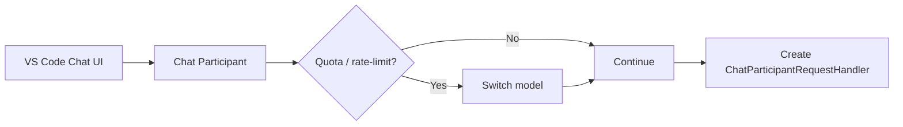

---

## 5. Từ request sang conversation state

### 5.1 Core class

Lớp xử lý request đầu tiên là:

- `src/extension/prompt/node/chatParticipantRequestHandler.ts`

### 5.2 Nó làm gì

Class này chịu trách nhiệm:

1. Xác định chat location
2. Dựng `Conversation` từ history
3. Sanitize prompt references / attachments
4. Kiểm tra permissive auth nếu dùng codebase tool
5. Chọn command/intent
6. Gọi intent handler thật sự

### 5.3 Sanitize references

`sanitizeVariables()` loại bỏ references tới file bị ignore.

Lý do:

- Agent không được vô tình dùng file đã bị cấu hình exclude
- Giảm nguy cơ lộ path hoặc file nhạy cảm

### 5.4 Rebuild conversation từ history

Handler không chỉ nhìn current prompt.

Nó:

- đọc `context.history`
- tìm lại các turn cũ
- khôi phục session id
- dựng `Conversation` object nội bộ

Điểm này rất quan trọng vì toàn bộ tool loop phía sau đều dựa vào conversation state này.

---

## 6. Chọn intent như thế nào

### 6.1 Intent là gì

Intent là abstraction mô tả “loại hành vi” cho request hiện tại.

Ví dụ:

- unknown/default panel chat
- edit
- generate
- agent
- ask agent
- notebook
- terminal

### 6.2 Logic chọn intent

Nếu request đi vào qua participant/command đã rõ thì dùng command/intended intent.

Nếu chưa rõ, handler fallback:

- editor + selection rỗng + dòng hiện tại trống -> thiên về `Generate`
- editor + selection nhiều dòng -> thiên về `Edit`
- không thì về unknown/default

### 6.3 Ý nghĩa

Đây là lớp “routing” quan trọng:

- cùng là một prompt user nhập
- nhưng vào panel chat khác editor inline chat thì flow khác
- vào `@agent` khác vào default participant thì prompt và tool set khác

---

## 7. Intent invocation và DefaultIntentRequestHandler

### 7.1 Core class

Sau khi chọn intent, extension thường đi vào:

- `src/extension/prompt/node/defaultIntentRequestHandler.ts`

### 7.2 Mô hình hoạt động

Intent không xử lý hết mọi thứ trực tiếp.

Thường nó trả về một `IIntentInvocation` gồm:

- `buildPrompt(...)`
- `getAvailableTools()`
- `processResponse(...)` nếu cần custom response handling
- option linkification
- các extra variables

Rồi `DefaultIntentRequestHandler` sẽ điều phối execution.

### 7.3 Những gì handler này làm

1. `intent.invoke(...)`
2. Chạy confirmation flow nếu có
3. Gắn telemetry / request logging
4. Tạo `ToolCallingLoop`
5. Chạy các hook đầu phiên và user prompt submit
6. Nhận kết quả cuối cùng
7. Gắn metadata vào chat result

### 7.4 Response stream participants

Nó còn bọc stream qua nhiều lớp:

- code block tracking
- edit survival tracking
- interaction outcome
- linkification
- telemetry tracking

Nghĩa là “response” không chỉ là text:

- nó có thể sinh edit parts
- reference parts
- usage info
- linkification
- structured metadata

---

## 8. Tool-calling loop: lõi của agent runtime

### 8.1 Core class

Lõi agent loop nằm ở:

- `src/extension/intents/node/toolCallingLoop.ts`

Đây là phần quan trọng nhất của toàn bộ extension nếu bạn muốn giải thích agent mode.

### 8.2 Vòng lặp chuẩn

Mỗi iteration làm:

1. Lấy danh sách tool hiện đang được phép dùng
2. Tạo `IBuildPromptContext`
3. Build prompt messages
4. Gọi model
5. Stream response
6. Thu các `toolCalls` từ delta stream
7. Nếu có tool call thì thực thi tool và lưu result
8. Lặp lại với prompt mới có tool result

### 8.3 Prompt context gồm gì

`createPromptContext(...)` dựng:

- `query`
- `history`
- `toolCallResults`
- `toolCallRounds`
- `editedFileEvents`
- `request`
- `chatVariables`
- `tools.toolReferences`
- `tools.availableTools`
- `modeInstructions`
- `additionalHookContext`

Đây là answer tốt nhất cho câu hỏi “context gồm những gì?”.

### 8.4 Stop conditions

Loop dừng khi:

- model không gọi tool nữa
- response không success
- user cancel
- hit tool call limit
- stop hook cho phép dừng
- autopilot đã gọi `task_complete`

### 8.5 Hook integration

Loop còn tích hợp:

- `SessionStart`
- `UserPromptSubmit`
- `Stop`
- `SubagentStart`
- `SubagentStop`

Ý nghĩa:

- runtime có thể bị policy/hook chèn thêm context
- hoặc chặn stop
- hoặc chặn/sửa tool input/output

### 8.6 Sequence đầy đủ

```mermaid
sequenceDiagram
    participant User as User
    participant CP as ChatParticipant
    participant RH as RequestHandler
    participant IRH as DefaultIntentRequestHandler
    participant Loop as ToolCallingLoop
    participant LLM as Language Model
    participant Tool as Tool Runtime

    User->>CP: Prompt
    CP->>RH: Handle request
    RH->>RH: sanitize refs + build conversation
    RH->>IRH: invoke intent
    IRH->>Loop: run()
    Loop->>Loop: buildPromptContext
    Loop->>LLM: messages + tool schemas
    LLM-->>Loop: streamed text / tool_calls
    alt tool calls exist
        Loop->>Tool: invoke tool
        Tool-->>Loop: tool result
        Loop->>Loop: append tool result
        Loop->>LLM: next round prompt
    else no tool calls
        Loop-->>IRH: final result
        IRH-->>RH: chat result
        RH-->>CP: response
        CP-->>User: final streamed output
    end
```

---

## 9. Model có quyết định tool không? Hay code quyết định?

### Câu trả lời ngắn

Cả hai, nhưng ở vai trò khác nhau.

### 9.1 Code quyết định “có được thấy tool này không”

Code quyết định:

- tool nào được expose cho request
- tool nào bị ẩn theo model capability
- tool nào bị user tool picker disable
- tool nào bị experiment flag tắt

### 9.2 Prompt quyết định “nên ưu tiên tool nào”

Prompt system nói rõ:

- nên search trước khi sửa
- nên dùng execution subagent cho terminal-heavy work
- không in code block nếu có edit tools
- nên đọc file bằng chunk lớn

### 9.3 Model quyết định “ở turn này gọi tool nào”

Sau khi nhìn:

- user prompt
- current context
- tool schemas
- system instructions

thì model mới sinh `tool_calls`.

### 9.4 Vì sao thiết kế này hợp lý

Nếu hardcode tất cả trong code:

- cứng
- khó mở rộng
- khó tận dụng reasoning của model

Nếu để model tự do hoàn toàn:

- khó kiểm soát safety/cost

Nên repo này chọn mô hình hybrid.

---

## 10. Tool system hoạt động như thế nào

### 10.1 Tool registration

Tool được import vào registry qua:

- `src/extension/tools/node/allTools.ts`
- `src/extension/tools/vscode-node/allTools.ts`

Sau đó `ToolsContribution` đăng ký chúng với VS Code LM API ở:

- `src/extension/tools/vscode-node/tools.ts`

### 10.2 Tool service

Service quan trọng:

- `src/extension/tools/vscode-node/toolsService.ts`

Nó làm các việc chính:

- lấy tool definitions hiện có
- map contributed tool names về internal tool names
- invoke tool
- log telemetry
- áp model-specific override
- filter enabled tools

### 10.3 Filter enabled tools

`getEnabledTools(...)` lọc tool dựa trên:

1. Tool picker selection
2. Explicit filter do caller truyền vào
3. Tag-based enablement
4. Tool vừa được cài bởi extension/tool khác
5. Model-specific override

### 10.4 Tool invocation

Khi tool chạy:

- mở telemetry span
- log input args
- gọi `vscode.lm.invokeTool(...)`
- log result
- log failure nếu lỗi

### 10.5 Tool categories xuất hiện trong repo

Các tool tiêu biểu:

- file read/search: `readFile`, `findFiles`, `findTextInFiles`, `codebase`
- edit: `editFile`, `replaceString`, `multiReplaceString`, `applyPatch`
- execution: terminal, execution subagent
- workspace/navigation: project structure, scm changes
- memory/todo
- notebook
- web fetch
- image
- subagent tools

---

## 11. Riêng agent mode chọn tools thế nào

### 11.1 Nơi quyết định

Agent mode dùng:

- `src/extension/intents/node/agentIntent.ts`

Hàm quan trọng:

- `getAgentTools(...)`

### 11.2 Những gì nó cân nhắc

Tool set phụ thuộc vào:

- model supports `apply_patch` hay không
- model supports `replace_string` hay không
- model có nên ưu tiên replace-only hay patch-only không
- repo hiện có tests/tasks không
- experiment flags bật search subagent / execution subagent không
- autopilot mode có cần `task_complete` không
- user có disable edit placeholder tool không

### 11.3 Điều này trả lời câu hỏi “khi nào quyết định dùng tool nào”

Ở lớp code:

- Agent mode không expose mọi tool ngang nhau
- Nó chọn ra “không gian hành động hợp lệ” theo model + config + workspace state

Sau đó prompt bias thêm, rồi model mới chọn cụ thể.

---

## 12. Prompt system và prompt rendering

### 12.1 Prompt không phải string concat thủ công

Repo này dùng:

- `@vscode/prompt-tsx`

Prompts nằm chủ yếu ở:

- `src/extension/prompts/node/`

### 12.2 Agent prompt

Prompt chính cho agent mode nằm ở:

- `src/extension/prompts/node/agent/agentPrompt.tsx`

Nó ghép:

- base instructions
- model-specific instructions
- custom instructions
- mode instructions
- memory instructions
- global agent context
- conversation history
- user message
- tool call history

### 12.3 Model-specific prompt registry

Registry ở:

- `src/extension/prompts/node/agent/promptRegistry.ts`

Nó map prompt theo:

- custom matcher `matchesModel()`
- hoặc family prefixes

Ý nghĩa:

- GPT, Claude, Gemini có thể nhận prompt style khác nhau
- nhưng vẫn đi qua cùng runtime loop

### 12.4 Default agent instructions

Prompt base ở:

- `src/extension/prompts/node/agent/defaultAgentInstructions.tsx`

Nó encode nhiều rule thực tế:

- gather context first
- ưu tiên search subagent
- ưu tiên execution subagent
- không show codeblock cho file edits
- dùng absolute path cho tool input
- dùng tools song song khi hợp lý

---

## 13. Context được tạo ra như thế nào

Context thật sự gửi vào model thường gồm các phần sau.

### 13.1 System context

- Copilot identity rules
- safety rules
- model-specific prompt rules

### 13.2 User/project instructions

- `.github/copilot-instructions.md`
- attached `.instructions.md`
- instructions từ settings
- mode instructions

### 13.3 Global workspace/environment context

- OS
- workspace structure
- memory
- terminal/workspace facts

### 13.4 Conversational context

- history turns
- summarized history nếu context lớn
- previous tool rounds
- tool results

### 13.5 Current-turn context

- current prompt
- attached references/files/locations/images
- tool references
- edited file events

### 13.6 Hook context

- context do `SessionStart`, `UserPromptSubmit`, `Stop` hooks bơm thêm

---

## 14. Compaction / summarization cho long-running threads

Đây là chỗ cực kỳ khớp với nội dung trong `meeting.txt`.

### 14.1 Nơi xử lý

- `src/extension/intents/node/agentIntent.ts`

### 14.2 Cơ chế

Khi prompt dài dần:

- extension đo token budget
- nếu gần đầy thì có thể summarize conversation history
- có background compaction
- có foreground compaction
- có thể re-render prompt sau khi compact

### 14.3 Ý nghĩa thực tế

Bạn không phải liên tục tạo chat mới chỉ vì sợ đầy context.

Mental model đúng hơn là:

- một thread cho một feature/chủ đề
- để system tự compact dần
- khi đổi hẳn domain/chủ đề thì hãy mở thread khác

### 14.4 Sơ đồ compaction

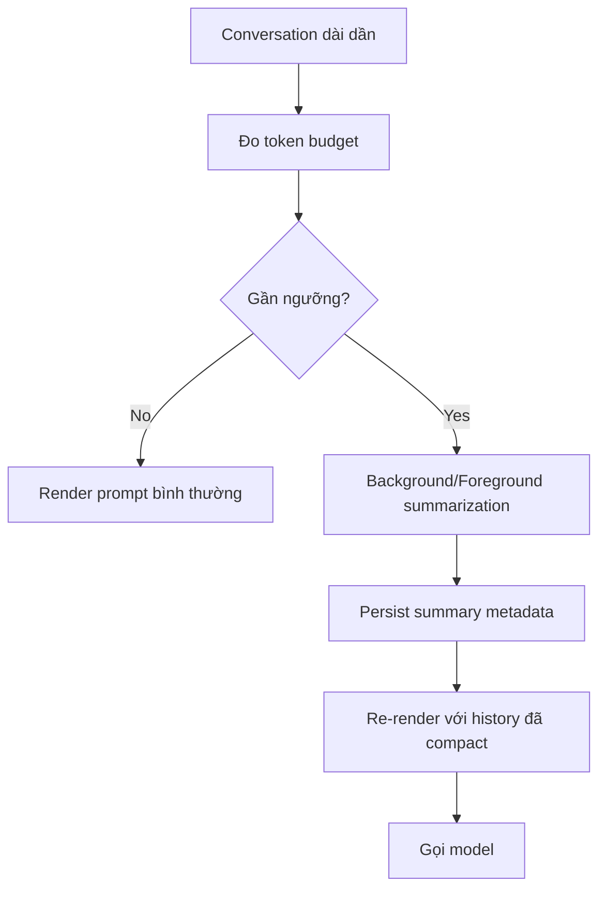

---

## 15. Hooks: trước tool, sau tool, start/stop

### 15.1 Các loại hook

Repo có hook types như:

- `SessionStart`
- `UserPromptSubmit`
- `PreToolUse`
- `PostToolUse`
- `SubagentStart`
- `SubagentStop`
- `Stop`

### 15.2 Chúng dùng để làm gì

- thêm policy/context
- validate hoặc sửa tool input
- block tool result
- ngăn agent dừng quá sớm

### 15.3 Ý nghĩa với kiến trúc

Hook là lớp policy/control rất quan trọng.

Nó cho phép:

- giữ runtime linh hoạt
- nhưng vẫn gắn guardrails

---

## 16. `.github/` được apply như thế nào

Đây là phần rất dễ nhầm. Không phải file nào trong `.github/` cũng auto đi vào prompt.

### 16.1 Nhóm A: GitHub infra

Các file như:

- `.github/workflows/*`
- `.github/dependabot.yml`
- `.github/CODEOWNERS`
- `.github/ISSUE_TEMPLATE/*`
- `.github/commands.json`

được GitHub hoặc GitHub Actions dùng.

Chúng **không tự động** trở thành prompt context cho Copilot Chat.

### 16.2 Nhóm B: Copilot instruction ecosystem

Các loại file có ý nghĩa trực tiếp cho chat/prompt system:

- `.github/copilot-instructions.md`
- `.github/instructions/*.instructions.md`
- `.github/agents/*.agent.md`
- `.github/prompts/*.prompt.md`
- `.github/skills/*/SKILL.md`

### 16.3 `.github/copilot-instructions.md`

Path mặc định được định nghĩa ở:

- `src/platform/customInstructions/common/promptTypes.ts`

Nó được load qua `CustomInstructionsService.getAgentInstructions()`.

Tức là:

- đây là file instruction mặc định cấp workspace/repo
- nếu setting bật, nó sẽ được đưa vào prompt như coding instructions

### 16.4 `.github/instructions/*.instructions.md`

Đây là scoped instruction files.

Chúng thường có frontmatter kiểu:

```md
---
applyTo: '**/*.ts'
description: ...
---
...
```

Ý nghĩa:

- dùng để áp rule theo glob/file scope
- hệ thống prompt/customization của VS Code quyết định file nào match
- sau đó extension consume chúng qua chat variables / customization index

Quan trọng:

- repo này không brute-force scan mọi `.instructions.md` mỗi request rồi tự match tất cả bằng tay
- nó dựa vào prompt-file/customization pipeline của platform

### 16.5 `.github/skills/*/SKILL.md`

Skill folders mặc định gồm:

- `.github/skills`
- `.claude/skills`

được định nghĩa tại:

- `src/platform/customInstructions/common/promptTypes.ts`

Khi `chat.useAgentSkills` bật:

- các file trong skill folder được xem là skill resources
- `SKILL.md` là entry chính
- nested files trong skill folder cũng được coi là thuộc skill đó

### 16.6 `.github/agents/*.agent.md`

Đây là custom agent definitions.

Chúng không phải code runtime trực tiếp, mà là prompt/agent resources cho chat system.

### 16.7 `.github/prompts/*.prompt.md`

Đây là reusable prompt files.

Có thể được attach/reuse trong chat flow như prompt resources.

### 16.8 Nhóm C: governance docs cho người và cho agent

Ví dụ:

- `.github/constitution.md`
- `.github/MODULE-ARCHITECTURE.md`
- `.github/module-dependency-map.json`

Các file này:

- không auto-inject vào mọi request
- nhưng cực kỳ hữu ích cho people + skills + custom agents
- thường chỉ được dùng khi prompt/skill/agent explicit yêu cầu đọc

Ví dụ skill `learn-codebase` explicit bảo đọc `MODULE-ARCHITECTURE.md`.

---

## 17. Cách custom instructions đi vào prompt

Prompt component:

- `src/extension/prompts/node/panel/customInstructions.tsx`

Nó gom instructions từ 3 nguồn chính:

1. Chat variables đã attach vào current request
2. Default repo instruction files như `.github/copilot-instructions.md`
3. Settings-based instructions

Rồi render vào prompt dưới tag `instructions`.

### Luồng

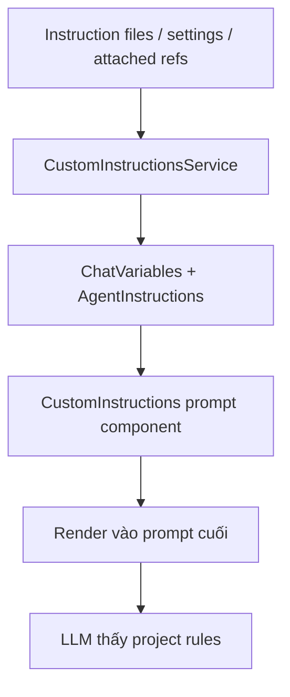

---

## 18. Ý nghĩa của các file `.github/` cụ thể trong repo này

### `.github/copilot-instructions.md`

Vai trò:

- global repo coding guidance
- architecture overview
- validation checklist
- style conventions

Đây là file rất đáng giữ tốt nếu muốn agent làm ổn định.

### `.github/instructions/*.instructions.md`

Các file hiện có:

- `prompt-tsx.instructions.md`
- `typescript.instructions.md`
- `vitest-unit-tests.instructions.md`

Vai trò:

- rules có scope hẹp hơn
- ví dụ TSX prompt files, TypeScript source, Vitest tests

Đây là cách tốt hơn nhiều so với nhét tất cả rule vào một file lớn.

### `.github/skills/*/SKILL.md`

Vai trò:

- hướng dẫn workflow chuyên biệt
- useful cho lệnh/skill kiểu `learn-codebase`, `review-code-changes`, `implement-feature`

### `.github/agents/*.agent.md`

Vai trò:

- tạo custom agents có persona/toolset/body riêng

### `.github/prompts/*.prompt.md`

Vai trò:

- reusable task template

### `.github/constitution.md`

Vai trò:

- governance cứng
- thích hợp làm “high-level invariant” cho cả người lẫn agent

### `.github/MODULE-ARCHITECTURE.md` và `module-dependency-map.json`

Vai trò:

- giúp tránh break layering
- rất quan trọng cho thay đổi kiến trúc

---

## 19. Context “nên” như thế nào trong thực tế

Đây là phần định hướng sử dụng, không chỉ mô tả code.

### 19.1 Những gì nên đưa vào prompt trực tiếp

- mục tiêu cụ thể
- expected outcome / acceptance criteria
- lỗi cụ thể hoặc symptom cụ thể
- file hoặc module neo quan trọng
- constraints đặc biệt

Ví dụ tốt:

- “Fix bug X, root cause likely quanh Y, cần giữ backward compatibility, chạy qua tests Z”

### 19.2 Những gì không nên spam

- dump quá nhiều file nếu agent đã có read/search tools
- nhồi cả đống kiến thức lặp lại ở mỗi prompt
- context không liên quan trực tiếp đến task hiện tại

### 19.3 Rule ổn định thì để ở đâu

Rule lặp đi lặp lại nên đưa vào:

- `.github/copilot-instructions.md`
- `.github/instructions/*.instructions.md`
- skill hoặc custom agent file

Thay vì prompt nào cũng copy paste.

### 19.4 Với long-running feature

Khuyến nghị:

- một thread cho một feature/subsystem
- tin vào compaction
- nếu task đổi domain quá xa thì mở thread khác

### 19.5 Với task khó verify

Nên cung cấp:

- test command
- expected observable behavior
- screenshot expectation
- error signature

Lý do:

- agent mạnh nhất khi tự verify được output của mình

---

## 20. `meeting.txt` giúp ích gì

File `docs/meeting.txt` có nhiều ý rất khớp với codebase này.

### 20.1 Ý khớp mạnh nhất

#### A. Một thread dài cho một feature

Khớp với:

- conversation compaction
- background/foreground summarization
- long-running context preservation

#### B. Agent nên tự research codebase trước

Khớp với:

- default prompt instructions
- search/read/codebase tools
- intent/runtime flow của repo

#### C. Plan mode chỉ dùng khi feature lớn / mơ hồ

Khớp với thực tế runtime:

- plan là một mode/use-case riêng
- không phải đường đi bắt buộc cho mọi task

#### D. Subagents và delegation

Khớp với:

- search subagent
- execution subagent
- subagent lifecycle hooks
- trace linking giữa parent và subagent

### 20.2 Insight sử dụng đáng rút ra

Nếu phải nói ngắn trong buổi họp:

- Agent này được thiết kế để tự làm homework trước
- Đừng overfeed context khi tooling đã đủ mạnh
- Dùng instructions/skills để encode conventions lâu dài
- Dùng verification để unlock chất lượng tốt nhất

---

## 21. Trả lời ngắn các câu hỏi “khi nào quyết định làm gì?”

### Khi nào chọn participant?

- do UI entrypoint và chat participant mà user đang dùng

### Khi nào chọn intent?

- sau khi request vào handler
- dựa trên participant/command/location/heuristics

### Khi nào quyết định model?

- trước xử lý sâu
- có thể switch vì quota/rate-limit

### Khi nào quyết định tool set?

- khi intent invocation được tạo
- dựa trên model capability, experiment flag, workspace state, tool picker

### Khi nào quyết định tool call cụ thể?

- lúc model đang sinh response

### Khi nào context bị compact?

- khi render prompt thấy gần đụng budget

### Khi nào dừng loop?

- khi không còn tool call hữu ích
- hoặc stop hook cho dừng
- hoặc đạt completion condition

---

## 22. Một cách giải thích cực ngắn cho buổi họp

Nếu cần nói nhanh 30-60 giây:

> Copilot Chat extension này chạy như một agent runtime nhiều lớp. UI gửi request vào chat participant, participant tạo request handler, handler dựng conversation và chọn intent. Intent chịu trách nhiệm build prompt và xác định tool set hợp lệ. Sau đó một tool-calling loop gọi model nhiều vòng; model có thể gọi tools, kết quả tool được bơm ngược lại vào prompt, rồi model tiếp tục cho đến khi hoàn tất. Các file trong `.github/` chỉ một phần được auto áp dụng, chủ yếu là `copilot-instructions.md`, `.instructions.md`, `.agent.md`, `.prompt.md`, `SKILL.md`; còn workflows, CODEOWNERS, commands.json là GitHub infra chứ không tự vào prompt. Về context, nên giữ thread theo feature, để hệ thống tự compact, và encode conventions dài hạn trong instruction files thay vì nhắc lại mỗi prompt.`

---

## 23. File/code tham chiếu chính

### Runtime flow

- `src/extension/extension/vscode/extension.ts`
- `src/extension/extension/vscode-node/services.ts`
- `src/extension/extension/vscode-node/contributions.ts`
- `src/extension/conversation/vscode-node/chatParticipants.ts`
- `src/extension/prompt/node/chatParticipantRequestHandler.ts`
- `src/extension/prompt/node/defaultIntentRequestHandler.ts`
- `src/extension/intents/node/toolCallingLoop.ts`

### Tool system

- `src/extension/tools/vscode-node/tools.ts`
- `src/extension/tools/vscode-node/toolsService.ts`
- `src/extension/tools/node/allTools.ts`
- `src/extension/intents/node/agentIntent.ts`

### Prompt system

- `src/extension/prompts/node/agent/agentPrompt.tsx`
- `src/extension/prompts/node/agent/defaultAgentInstructions.tsx`
- `src/extension/prompts/node/agent/promptRegistry.ts`
- `src/extension/prompts/node/panel/customInstructions.tsx`

### Customization / `.github`

- `src/platform/customInstructions/common/promptTypes.ts`
- `src/platform/customInstructions/common/customInstructionsService.ts`
- `.github/copilot-instructions.md`
- `.github/instructions/*.instructions.md`
- `.github/skills/*/SKILL.md`

---

## 24. Kết luận

Kiến trúc của extension này có thể tóm thành 3 ý:

1. **Routing và orchestration bằng code**
   - participant
   - intent
   - tool exposure
   - hook/policy

2. **Strategy bằng prompt**
   - cách research
   - cách edit
   - khi nào ưu tiên tool nào
   - formatting/final answer behavior

3. **Decision theo tình huống bằng model**
   - tool call cụ thể
   - số vòng lặp cần thiết
   - context nào đáng đào sâu thêm

Đây là lý do repo này vừa đủ kiểm soát để an toàn, vừa đủ linh hoạt để hành xử giống một coding agent thực sự.

---

## 25. Flow cực chi tiết từ lúc user gõ prompt

Phần này viết lại flow ở mức chi tiết hơn, gần với sequence runtime thật.

### 25.1 Giai đoạn A - UI gửi request vào extension

#### Bước A1. User gửi prompt

User có thể gửi prompt từ:

- chat panel
- inline chat
- notebook chat
- terminal panel chat
- participant chuyên biệt như `@workspace`, `@vscode`, `@terminal`, `@agent`

#### Bước A2. VS Code chat API gọi request handler của participant

Participant được tạo bằng:

- `vscode.chat.createChatParticipant(...)`

Repo này tạo participant tại:

- `src/extension/conversation/vscode-node/chatParticipants.ts`

#### Bước A3. Participant chuẩn hóa request ở mức đầu vào

Participant handler làm ngay các việc sau:

1. kiểm tra có cần switch model không
2. xử lý confirmation đặc biệt như auto-switch-to-auto
3. đánh dấu interaction mới nếu đây không phải subagent
4. gán telemetry message id cho first turn
5. chọn default intent theo participant

### Sơ đồ A

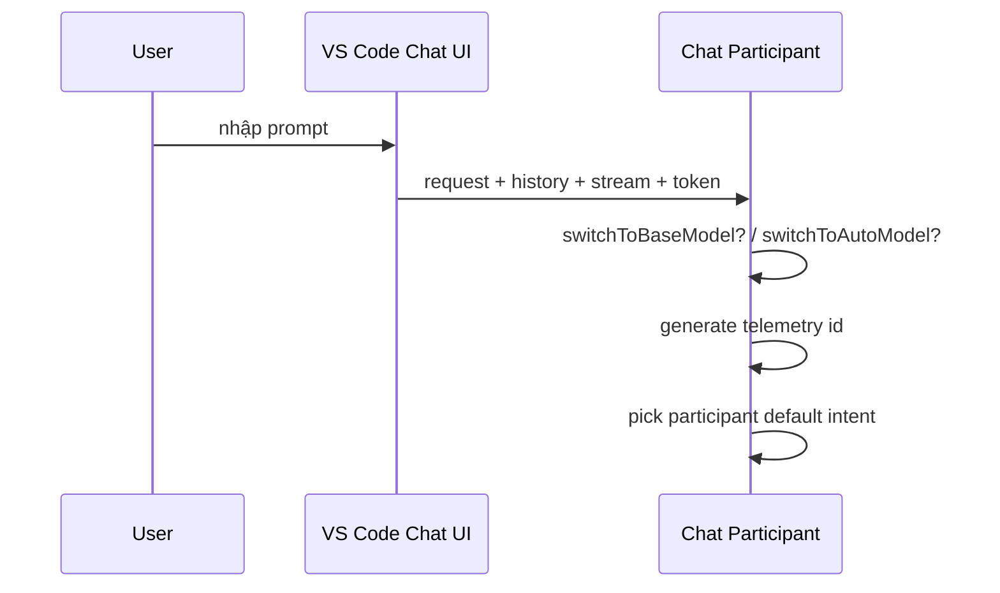

### 25.2 Giai đoạn B - Request handler dựng internal state

#### Bước B1. Tạo `ChatParticipantRequestHandler`

Class:

- `src/extension/prompt/node/chatParticipantRequestHandler.ts`

#### Bước B2. Xác định request location

Nó map request vào:

- Editor
- Panel
- Terminal
- Notebook
- Other

Location ảnh hưởng trực tiếp tới:

- intent choice
- prompt style
- available context
- cách render response

#### Bước B3. Dựng conversation từ history

Handler:

- parse history turns của VS Code
- cố tìm turn object cũ trong `ConversationStore`
- nếu không có thì reconstruct turn mới từ request/response history
- lấy `sessionId`

Điểm này cực quan trọng:

- model không chỉ nhìn current prompt
- mà nhìn một internal conversation object đầy đủ hơn

#### Bước B4. Suy ra document context

Nếu đang ở editor/notebook:

- infer active document
- selection
- surrounding context

#### Bước B5. Sanitize references

`sanitizeVariables()`:

- loại references nằm trong ignored files
- có thể xóa path khỏi user message nếu path nhạy cảm

#### Bước B6. Auth gating

Nếu request đang đụng tới `codebase` tool mà auth chưa đủ:

- có thể yêu cầu permissive auth upgrade
- và dừng request sớm

### Sơ đồ B

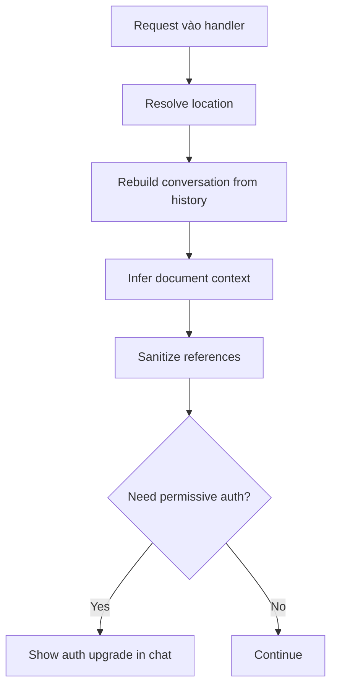

### 25.3 Giai đoạn C - Chọn command / intent

#### Bước C1. Resolve command

Nếu participant đã ngầm mang sẵn intent hoặc slash command:

- lấy command tương ứng

#### Bước C2. Nếu chưa rõ thì dùng heuristic

Ví dụ editor:

- selection rỗng + dòng hiện tại trống -> nghiêng về generate
- selection nhiều dòng -> nghiêng về edit

#### Bước C3. Kiểm tra command usage hợp lệ

Nếu command yêu cầu args mà user không nhập:

- trả usage error luôn

### Sơ đồ C

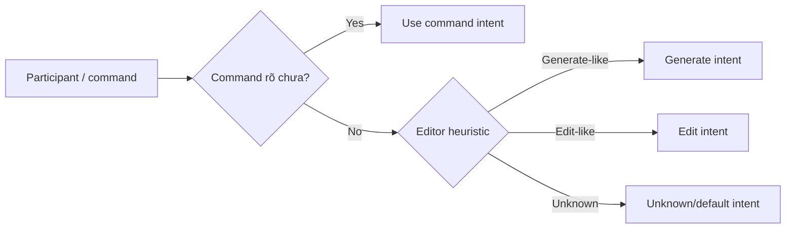

### 25.4 Giai đoạn D - Intent invocation

#### Bước D1. Gọi `intent.invoke(...)`

Intent không nhất thiết trả lời ngay.

Thông thường nó trả object mô tả:

- prompt builder
- tool provider
- response processor
- confirmation handler
- extra vars

#### Bước D2. `DefaultIntentRequestHandler` tiếp quản

Class:

- `src/extension/prompt/node/defaultIntentRequestHandler.ts`

#### Bước D3. Nếu cần thì xử lý confirmation

Ví dụ các flow cần user confirm trước khi tiếp tục.

#### Bước D4. Thiết lập request logging / telemetry

Repo này log rất nhiều:

- request id
- session id
- model usage
- tool rounds
- subagent traces

### 25.5 Giai đoạn E - Chạy hooks đầu vòng

Trước khi build prompt vòng đầu, runtime có thể chạy:

- `SessionStart`
- `SubagentStart`
- `UserPromptSubmit`

Các hook này có thể:

- thêm context
- block request
- yêu cầu policy bổ sung

Điểm này quan trọng vì “context gửi lên LLM” không chỉ đến từ user và workspace, mà còn có thể đến từ hook system.

### 25.6 Giai đoạn F - Tạo prompt context

`ToolCallingLoop.createPromptContext(...)` tạo object nền cho prompt render.

Nó gồm:

- `query`
- `history`
- `toolCallResults`
- `toolCallRounds`
- `editedFileEvents`
- `request`
- `chatVariables`
- `tools.toolReferences`
- `tools.availableTools`
- `modeInstructions`
- `additionalHookContext`

Nói cách khác:

- đây là “vũ trụ dữ liệu” để render prompt cho turn hiện tại

### 25.7 Giai đoạn G - Chọn tool set cho vòng hiện tại

#### Bước G1. Lấy all registered tools

Từ:

- internal tool registry
- VS Code LM-contributed tools
- model-specific tools

#### Bước G2. Intent filter tool

Ví dụ agent mode:

- cân nhắc model supports `apply_patch`, `replace_string`, `multi_replace_string`
- cân nhắc tests/tasks có tồn tại không
- cân nhắc experiment flags
- cân nhắc autopilot có cần `task_complete` không

#### Bước G3. `ToolsService.getEnabledTools(...)`

Áp thêm:

- tool picker on/off
- enable-by-tag
- extension-installed-by-tool
- model-specific override

### Sơ đồ G

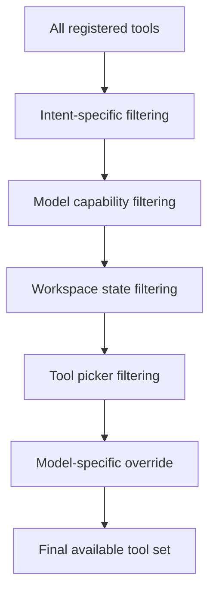

### 25.8 Giai đoạn H - Render prompt

#### Bước H1. Prompt registry resolve model-specific prompt

`PromptRegistry` chọn prompt resolver theo model family / matcher.

#### Bước H2. Agent prompt được dựng

Prompt chính thường gồm:

- system/base instructions
- safety rules
- identity rules
- memory instructions
- custom instructions
- mode instructions
- global agent context
- conversation history
- user message
- tool call history
- tool results

#### Bước H3. Nếu context lớn thì summarize/compact

Agent mode có thể:

- apply summary có sẵn
- chờ background compaction
- trigger foreground summarization
- re-render lại prompt

### 25.9 Giai đoạn I - Gọi model

Sau khi prompt render xong:

- messages được post-process
- tool schemas được normalize
- request options được gắn

Runtime gửi lên model:

- `messages`
- `tools`
- `enableThinking`
- `reasoningEffort`

#### Bước I1. Response stream về dần

Trong lúc model stream response:

- text được đẩy ra UI
- tool calls được thu gom
- thinking data có thể được giữ lại
- context compaction marker/stateful marker có thể được ghi nhận

### 25.10 Giai đoạn J - Nếu model gọi tool

#### Bước J1. Tool call được parse

Runtime lưu:

- tool id
- tool name
- arguments

#### Bước J2. Chạy `PreToolUse`

Hook có thể:

- deny
- ask
- modify input

#### Bước J3. Invoke tool

`ToolsService.invokeTool(...)`:

- log telemetry
- gọi `vscode.lm.invokeTool(...)`
- nhận result/failure

#### Bước J4. Chạy `PostToolUse`

Hook có thể:

- block tool result
- rewrite tool result context

#### Bước J5. Tool result được nhét lại vào prompt state

Tool result metadata được ghi vào `toolCallResults`.

Turn sau prompt renderer sẽ thấy chúng.

### Sơ đồ J

```mermaid
sequenceDiagram
    participant L as LLM
    participant Loop as Tool Loop
    participant Hook as Hook System
    participant T as Tool

    L-->>Loop: tool_call(name, args)
    Loop->>Hook: PreToolUse
    Hook-->>Loop: allow/deny/modified input
    Loop->>T: invoke tool
    T-->>Loop: result/error
    Loop->>Hook: PostToolUse
    Hook-->>Loop: final tool result context
    Loop->>Loop: store toolCallResults
    Loop->>L: next round with tool result in messages
```

### 25.11 Giai đoạn K - Lặp các round

Tool loop cứ tiếp tục:

1. build prompt mới
2. gửi model
3. lấy tool calls mới nếu có
4. thực thi

Cho tới khi:

- model không gọi tool nữa
- lỗi
- hit tool limit
- stop hook nói chưa được dừng
- user cancel
- autopilot chưa `task_complete`

### 25.12 Giai đoạn L - Stop logic

Trước khi dừng hẳn, runtime có thể gọi:

- `Stop`
- `SubagentStop`

Nếu hook block stop:

- lý do bị block sẽ được chèn lại vào prompt round kế tiếp
- model phải tiếp tục làm

Đây là cơ chế rất hay:

- “dừng hay chưa” không chỉ do model tự thấy xong
- mà còn do policy layer can thiệp

### 25.13 Giai đoạn M - Final answer

Khi đã đủ điều kiện dừng:

- response được process/finalize
- metadata được gắn vào result
- references/tool rounds được giữ
- stream kết thúc

User nhìn thấy:

- markdown/text
- references
- warnings
- edits
- usage info

### 25.14 Full end-to-end mega flow

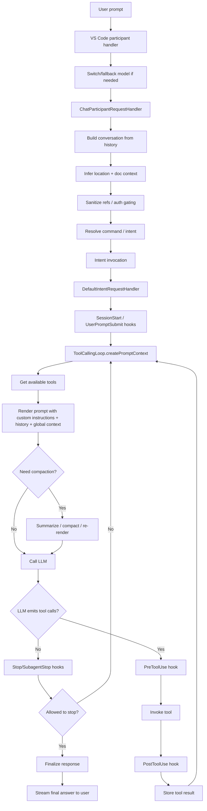

---

## 26. Nếu muốn user làm việc tốt với VS Code Copilot Chat thì nên làm gì

Đây là phần practical nhất.

### 26.1 Nguyên tắc lớn

Muốn agent làm tốt thì phải tối ưu 4 thứ:

1. task framing
2. verification
3. instruction hygiene
4. thread hygiene

### 26.2 Task framing: viết prompt thế nào cho agent làm tốt

Prompt tốt thường có 4 thành phần:

- mục tiêu
- phạm vi
- ràng buộc
- tiêu chí xong việc

Ví dụ tốt:

```text
Fix bug ở flow login khi token hết hạn.
Chỉ sửa phần auth refresh và call site liên quan.
Không đổi public API.
Xong khi unit test pass và login không bị redirect loop nữa.
```

Ví dụ kém:

```text
check giúp mình cái auth này với
```

### 26.3 Hãy nói rõ “done là gì”

Agent mạnh hơn rất nhiều khi có điều kiện hoàn thành rõ ràng:

- test nào phải pass
- behavior nào phải đúng
- output nào phải thấy
- file nào không được đụng

Nếu không có “done criteria”, model dễ:

- trả lời sớm
- fix symptom thay vì root cause
- bỏ sót verify

### 26.4 Hãy đưa thông tin verify được

Đặc biệt nên đưa:

- lỗi cụ thể
- command test/build/lint
- expected screenshot/UI behavior
- stack trace
- reproduction steps

Lý do:

- agent rất mạnh ở loop `try -> verify -> refine`
- agent yếu hơn nhiều nếu chỉ “đoán cho đúng”

### 26.5 Đừng overfeed context

Đây là lỗi phổ biến.

Không cần attach 10 file chỉ vì bạn nghĩ “chắc liên quan”.

Với repo kiểu này, agent đã có:

- search
- read
- codebase
- workspace structure

Nên thay vì dump file, hãy cho:

- 1-2 anchor file
- 1 error
- 1 expected outcome

Rồi để agent tự research.

### 26.6 Nhưng cũng đừng under-specify

Nếu task có hidden constraints mà không nói ra, agent dễ làm “đúng kỹ thuật nhưng sai mong muốn”.

Ví dụ các constraint nên nói:

- đừng đổi public API
- giữ backward compatibility
- không thêm dependency mới
- theo style hiện có
- chỉ patch tối thiểu

### 26.7 Chia thread theo feature, không theo từng tin nhắn nhỏ

Khuyến nghị:

- một thread cho một feature / bug / refactor chủ đề tương đối thống nhất
- follow-up trong cùng thread nếu vẫn cùng domain
- đổi hẳn chủ đề thì mở thread khác

Lý do:

- history trong thread là tài sản
- compaction của hệ thống được tối ưu cho kiểu làm việc này

### 26.8 Khi nào nên dùng plan mode

Nên dùng khi:

- feature lớn
- nhiều tradeoff
- yêu cầu còn mơ hồ
- cần hỏi ngược để rõ scope

Không nhất thiết dùng khi:

- bug nhỏ
- task đã rất rõ
- chỉ cần sửa cụ thể

### 26.9 Encode rule bền vững vào instruction files

Đừng nhắc đi nhắc lại trong prompt những rule như:

- style TypeScript
- test conventions
- prompt-tsx conventions
- kiến trúc layering

Hãy đặt vào:

- `.github/copilot-instructions.md`
- `.github/instructions/*.instructions.md`
- skill files nếu là workflow đặc thù

Lợi ích:

- giảm prompt noise
- tăng consistency
- đỡ phải nhớ

### 26.10 Tổ chức `.github/instructions` theo scope nhỏ

Rất nên tách theo domain:

- `typescript.instructions.md`
- `react.instructions.md`
- `tests.instructions.md`
- `prompt-tsx.instructions.md`
- `architecture.instructions.md`

Thay vì nhét mọi thứ vào một file rất dài.

### 26.11 Viết instruction theo kiểu hành động được

Instruction tốt:

- cụ thể
- ưu tiên được
- đo được
- không mâu thuẫn

Ví dụ tốt:

- “Dùng tabs, không dùng spaces”
- “Mọi service injectable phải qua DI”
- “Không dùng any trừ khi có comment giải thích”

Ví dụ kém:

- “Write clean code”
- “Be smart”

### 26.12 Giữ docs gần code

Nếu team làm nhiều với agent, rất nên:

- có `docs/` hoặc `adr/`
- có file mô tả setup/dev flow
- có decision log ngắn cho kiến trúc
- có runbook cho test/debug

Không phải vì agent “cần markdown”, mà vì:

- agent đọc docs cực tốt
- docs tốt giảm số vòng tool calls và giảm hallucination

### 26.13 Nếu task khó, cho agent 1 bản đồ hơn là cho agent 1 dump

Thứ agent cần hơn 5000 dòng code là:

- chỗ nào bắt đầu đọc
- chỗ nào là source of truth
- chỗ nào không được đụng

Ví dụ:

```text
Bug nằm quanh panel chat tool loop.
Source of truth là ToolCallingLoop và AgentIntent.
Không đổi behavior của inline chat.
```

Thông tin kiểu này leverage cực mạnh.

### 26.14 Luôn cung cấp “negative constraints”

Những thứ không được làm cũng quan trọng như thứ phải làm:

- không đổi UI copy
- không đổi endpoint contract
- không thêm package
- không động vào generated file

### 26.15 Với UI task, đưa expectation bằng hình hoặc bằng tiêu chí quan sát được

Ví dụ:

- hero section phải nằm above fold
- mobile không wrap nút thành 2 dòng
- màu chính là xanh đậm, không dùng tím

Điều này tốt hơn nói:

- “làm cho đẹp”

### 26.16 Với code review / hỏi đáp

Nếu chỉ cần giải thích hoặc review:

- nói rõ là không cần sửa code
- hoặc dùng ask/read-only mode nếu team có

Điều này làm agent chọn tool set phù hợp hơn.

---

## 27. Context nên đưa như thế nào cho từng loại task

### 27.1 Bug fix

Nên đưa:

- symptom
- expected behavior
- reproduction
- error log / stack trace
- file nghi ngờ nếu biết

Template:

```text
Fix bug: ...
Repro: ...
Expected: ...
Observed: ...
Likely area: ...
Done when: ...
```

### 27.2 Refactor

Nên đưa:

- mục tiêu refactor
- cái gì phải giữ nguyên
- scope file/module
- test/verification

Template:

```text
Refactor ... để ...
Giữ nguyên public API / behavior.
Chỉ đụng các module ...
Done when tests ... vẫn pass.
```

### 27.3 Feature mới

Nên đưa:

- user outcome
- acceptance criteria
- UI/API constraints
- rollout / compatibility concerns

Template:

```text
Add feature ...
User should be able to ...
Constraints: ...
Acceptance criteria:
1. ...
2. ...
3. ...
```

### 27.4 Investigation / architecture question

Nên đưa:

- câu hỏi thật sự cần trả lời
- depth mong muốn
- module nghi ngờ

Template:

```text
Investigate how ...
Focus on ...
Explain with code references.
Call out tradeoffs and risks.
```

### 27.5 Review

Nên đưa:

- phạm vi review
- tiêu chí review
- có/không cần nits

Template:

```text
Review changes in ...
Focus on regressions, missing tests, security, behavior changes.
Ignore style nits.
```

---

## 28. Maturity model cho team dùng agent tốt

Nếu muốn team dùng Copilot Chat hiệu quả, thường cần tiến qua các mức sau.

### Level 1 - Prompt thủ công

Team chỉ chat ad-hoc.

Đặc điểm:

- kết quả phụ thuộc người nào prompt giỏi
- khó lặp lại

### Level 2 - Repo instructions

Team thêm:

- `.github/copilot-instructions.md`
- scoped `.instructions.md`

Đặc điểm:

- consistency tốt hơn
- ít phải nhắc rule lặp lại

### Level 3 - Docs + runbooks

Team có:

- setup docs
- architecture docs
- test/debug runbook
- ADRs

Đặc điểm:

- agent research nhanh hơn
- ít hallucination hơn

### Level 4 - Skills / custom agents / prompts

Team bắt đầu encode workflow:

- code review
- investigate bug
- implement feature
- generate tests

Đặc điểm:

- dùng agent như reusable workflow

### Level 5 - Verification-first development

Team tối ưu:

- tests
- screenshots
- reproducible checks
- CI/CD automation

Đây là mức agent phát huy tốt nhất.

---

## 29. Checklist rất thực dụng cho user

### Trước khi gửi prompt

- Mình muốn outcome gì?
- Scope ở đâu?
- Có constraint nào không?
- Done khi nào?
- Có cách verify nào không?

### Khi prompt task code

- Gắn 1-2 file neo nếu biết
- Đưa lỗi hoặc behavior cụ thể
- Nói rõ đừng đụng phần nào nếu cần

### Khi task lớn

- Bắt đầu bằng plan mode hoặc yêu cầu plan ngắn
- Sau đó mới implement

### Khi làm lâu trên một feature

- Giữ cùng thread
- Để compaction làm việc

### Sau vài lần agent vấp cùng một lỗi

- đừng chỉ prompt lại
- đưa rule đó vào `.github/instructions` hoặc `copilot-instructions.md`

---

## 30. Một số anti-pattern khi làm việc với agent

### Anti-pattern 1: Dump cả repo vào prompt

Vấn đề:

- tốn context
- nhiễu
- che mất signal quan trọng

### Anti-pattern 2: Prompt quá ngắn và mơ hồ

Vấn đề:

- agent phải tự đoán scope
- dễ chọn sai “done condition”

### Anti-pattern 3: Dùng mỗi prompt để encode team conventions

Vấn đề:

- lặp lại
- không bền
- mỗi người prompt một kiểu

### Anti-pattern 4: Tạo thread mới liên tục cho cùng một feature

Vấn đề:

- mất historical context
- tốn lại công research

### Anti-pattern 5: Không cho cách verify

Vấn đề:

- agent phải đoán
- kết quả “trông hợp lý” nhưng chưa chắc đúng

---

## 31. Prompt templates khuyến nghị cho team

### 31.1 Bug fix

```text
Fix bug in <area>.
Observed:
Expected:
Repro:
Constraints:
Done when:
```

### 31.2 Feature

```text
Implement feature: <name>
User outcome:
Constraints:
Do not change:
Acceptance criteria:
1.
2.
3.
```

### 31.3 Investigation

```text
Investigate how <thing> works in this codebase.
Focus on:
Explain with file references.
Call out risks, assumptions, and likely extension points.
```

### 31.4 Review

```text
Review changes in <scope>.
Prioritize:
- bugs
- regressions
- missing tests
- security / data issues
Ignore style nits unless severe.
```

---

## 32. Kết luận thực dụng cho người dùng

Muốn dùng tốt VS Code Copilot Chat kiểu agentic, cách nghĩ hiệu quả nhất là:

- xem agent như một senior engineer mới join team
- giao task bằng outcome + constraints + verification
- để agent tự research thay vì spoon-feed quá nhiều file
- encode conventions vào instruction files
- giữ thread theo feature để tận dụng compaction
- đầu tư vào docs và test để agent tự verify được

Nói ngắn hơn:

> Context tốt không phải là context nhiều. Context tốt là context đúng, có cấu trúc, có signal mạnh, và có định nghĩa rõ “xong là gì”.

---

## 33. Inventory cực chi tiết: dữ liệu nào có thể đi vào prompt gửi lên LLM

Phần này liệt kê theo kiểu inventory để sau này dễ tách ra thành common docs hoặc onboarding materials.

### 33.1 Nhóm A - Dữ liệu đến trực tiếp từ user request

#### A1. Prompt text

Nguồn:

- text user gõ trong chat input

Đi vào đâu:

- `request.prompt`
- sau đó vào `turn.request.message`
- rồi thành `query` trong `IBuildPromptContext`
- cuối cùng được render thành user message trong prompt

#### A2. Chat references / attachments

Có thể gồm:

- file
- location/range
- image
- prompt file
- instruction file
- internal resource

Đi vào đâu:

- `request.references`
- được wrap thành `ChatVariablesCollection`
- prompt renderer có thể chọn render toàn bộ, một phần, hoặc chỉ metadata

#### A3. Tool references

User có thể attach hoặc enable tool references.

Đi vào đâu:

- `request.toolReferences`
- được đưa vào `promptContext.tools.toolReferences`
- có thể tác động tới cả tool selection lẫn prompt wording

#### A4. Mode instructions

Nếu user đang ở custom mode hoặc mode có instruction riêng:

- `request.modeInstructions2`

Đi vào đâu:

- `promptContext.modeInstructions`
- rồi được inject vào prompt dưới tag `modeInstructions`

#### A5. Edited file events

Nếu request gắn với edited-file events:

- `request.editedFileEvents`

Đi vào đâu:

- `promptContext.editedFileEvents`
- có thể được dùng khi prompt cần biết user đã sửa gì gần đây

### 33.2 Nhóm B - Dữ liệu đến từ conversation/history

#### B1. Previous turns

Nguồn:

- `context.history`

Đi vào đâu:

- rebuild thành `Conversation.turns`
- đưa vào `promptContext.history`
- render thành conversation history hoặc summarized history

#### B2. Previous assistant messages

Bao gồm:

- text đã trả lời
- tool calls cũ
- tool results cũ
- metadata của round

Tác dụng:

- giúp model biết đã làm tới đâu
- tránh lặp việc
- tiếp tục đúng trạng thái

#### B3. Summaries / compaction artifacts

Nguồn:

- background summarization
- foreground compaction

Đi vào đâu:

- metadata trên turns
- render lại thành summarized conversation block

### 33.3 Nhóm C - Dữ liệu đến từ workspace/editor state

#### C1. Active document context

Có thể gồm:

- file hiện tại
- selection
- surrounding code
- notebook context

Đi vào đâu:

- `documentContext`
- rồi được intent-specific prompt builder dùng

#### C2. Workspace structure

Nguồn:

- workspace folders
- project structure prompts

Đi vào đâu:

- global agent context
- project structure prompt components

#### C3. Open tabs / editors

Nguồn:

- tab/editor services

Vai trò:

- hỗ trợ infer document context
- hỗ trợ attachment/reference logic

#### C4. Diagnostics / errors

Nguồn:

- diagnostics context
- tools như `getErrors`

Đi vào prompt theo 2 kiểu:

- inline context ban đầu
- hoặc tool result ở các round sau

### 33.4 Nhóm D - Dữ liệu đến từ system instructions

#### D1. Base agent instructions

Nguồn:

- `defaultAgentInstructions.tsx`
- model-specific prompt files

Vai trò:

- define persona
- define workflow bias
- define tool-usage policy

#### D2. Safety rules / identity rules

Nguồn:

- prompt components riêng

Vai trò:

- safety
- formatting rules
- behavior constraints

#### D3. Autopilot/task-complete rules

Khi permission level là autopilot:

- prompt được bơm thêm rule bắt buộc `task_complete`

### 33.5 Nhóm E - Dữ liệu đến từ custom instructions ecosystem

#### E1. `.github/copilot-instructions.md`

Được load như repo-level instruction file.

#### E2. `.instructions.md` đã match scope

Có thể đến từ:

- workspace
- user data
- extension-contributed prompt files

#### E3. Settings-based instructions

Ví dụ:

- code generation instructions
- code review instructions
- commit message instructions

#### E4. Prompt variables / customization index

Đây là một nguồn rất quan trọng nhưng dễ bị bỏ sót:

- có một customizations index
- trong đó chứa list các instructions, skills, agents đã resolve
- prompt có thể dùng index này để biết attachment nào là “special customization resource”

### 33.6 Nhóm F - Dữ liệu đến từ hooks

#### F1. SessionStart

Có thể thêm:

- additional context cho cả session

#### F2. UserPromptSubmit

Có thể thêm:

- additional context cho current request
- block decision

#### F3. Stop/SubagentStop

Không phải input ban đầu, nhưng có thể bơm:

- lý do không được dừng

vào round kế tiếp.

### 33.7 Nhóm G - Dữ liệu đến từ tools

#### G1. Tool schemas

Gửi lên model ngay tại request:

- name
- description
- input schema

#### G2. Tool results

Đến từ:

- read/search/codebase
- edit tools
- web fetch
- notebook
- memory/todo
- subagents

Tool result thường không lên model ở cùng round model gọi tool, mà lên model ở round kế tiếp.

#### G3. Tool call history

Prompt renderer có thể đưa cả:

- tool call names
- arguments
- output summaries

để model biết tiến trình đã diễn ra.

### 33.8 Nhóm H - Dữ liệu đến từ memory

Nguồn:

- memory tool
- session/user/repo scoped memories

Đi vào đâu:

- memory instructions
- memory context prompt

### 33.9 Nhóm I - Dữ liệu environment/runtime

Có thể gồm:

- OS
- shell
- session resource
- model family
- some endpoint-specific settings

Đi vào prompt chủ yếu qua global context và system instructions.

### 33.10 Những thứ thường không được gửi nguyên xi lên model

Thường không lên nguyên xi:

- raw telemetry logs
- internal debug files
- toàn bộ repo
- mọi file trong `.github/`
- mọi open tab
- toàn bộ local environment vars

Chỉ những gì được prompt builder chọn render hoặc tool loop chọn expose mới lên model.

---

## 34. Context transformation pipeline

Không có chuyện “local state = prompt”.

Giữa local data và prompt cuối có nhiều bước biến đổi.

### 34.1 Pipeline

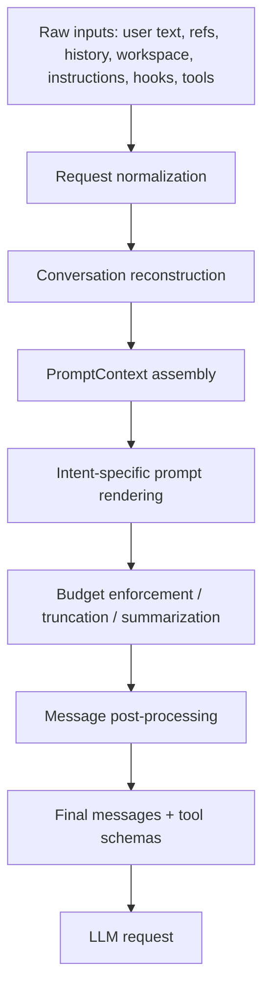

### 34.2 Ý nghĩa

Mỗi bước có thể:

- bỏ bớt dữ liệu
- tóm tắt dữ liệu
- đổi dạng dữ liệu
- thêm context mới
- chặn context không hợp lệ

Nên khi thiết kế common docs cho team, cần nghĩ theo pipeline này chứ không chỉ nghĩ “viết docs thật nhiều”.

---

## 35. Mô hình Signal / Noise / Cost cho context

Nếu muốn tối ưu context tốt, nên phân loại mỗi mẩu context theo 3 trục:

- **Signal**: mức độ giúp giải đúng task
- **Noise**: mức độ làm prompt loãng hoặc lệch hướng
- **Cost**: chi phí token/tool/time để có được context đó

### 35.1 Context tốt

Context tốt là context có:

- signal cao
- noise thấp
- cost hợp lý

Ví dụ:

- stack trace ngắn nhưng đúng bug
- 1 file source of truth
- 1 acceptance criteria rõ
- 1 architectural invariant quan trọng

### 35.2 Context xấu

Context xấu là:

- signal thấp
- noise cao
- cost cao

Ví dụ:

- dump cả file lớn không liên quan
- paste cả chat cũ không cùng chủ đề
- đưa 10 constraints mâu thuẫn
- attach docs chung chung không action được

---

## 36. Chiến lược tối ưu context ở mức cá nhân

### 36.1 Dùng anchor thay vì dump

Thay vì nói:

- “đọc hết auth”

Nói:

- “source of truth là `AuthRefreshService` và `sessionStore`”

Điều này:

- giảm noise
- giúp agent bắt đầu đúng chỗ

### 36.2 Dùng constraints âm

Ví dụ:

- không đổi public API
- không chạm inline chat
- không thêm dependency

Constraints âm làm giảm branching factor của agent rất nhiều.

### 36.3 Tách intent của prompt

Mỗi prompt nên khá rõ đang là:

- ask/explain
- review
- investigate
- implement
- refactor
- verify

Đừng trộn quá nhiều intent trong 1 prompt đầu tiên.

Ví dụ kém:

- “giải thích kiến trúc này, sửa bug này, review giúp luôn, rồi đề xuất roadmap”

Hãy chia thành từng bước hoặc ít nhất nói rõ ưu tiên.

### 36.4 Dùng iterative narrowing

Với task khó, pattern tốt là:

1. investigate
2. confirm root cause / plan
3. implement
4. verify

Điều này thường cho kết quả tốt hơn “một prompt làm hết” khi task còn mơ hồ.

### 36.5 Đừng attach file chỉ vì đang mở tab

Một file đang mở tab chưa chắc đáng gửi lên model.

Chỉ attach nếu file đó là:

- source of truth
- likely bug location
- hard constraint
- example cần agent noi theo

### 36.6 Đưa examples nếu team có style đặc thù

Nếu repo có pattern khó suy ra:

- cho 1 example implementation tốt
- hoặc chỉ rõ module tham chiếu

Ví dụ:

- “follow style of X service”
- “mirror pattern used in Y tool”

### 36.7 Cho agent biết ưu tiên verify cái gì

Ví dụ:

- “verify bằng unit test trước, không cần e2e”
- “nếu không chạy app được thì ít nhất chạy lint + test relevant”

Agent sẽ biết dành token/tool budget vào đâu.

---

## 37. Chiến lược tối ưu context ở mức team / repo

### 37.1 Tầng hóa tài liệu

Một repo tốt cho agent thường có 4 tầng docs:

#### Tầng 1 - Global rules

Ví dụ:

- `.github/copilot-instructions.md`

Chứa:

- style chung
- architecture invariants
- validation expectations

#### Tầng 2 - Scoped instructions

Ví dụ:

- `.github/instructions/typescript.instructions.md`
- `.github/instructions/tests.instructions.md`

Chứa:

- rules chuyên biệt theo file pattern/domain

#### Tầng 3 - Workflow docs

Ví dụ:

- `docs/how-we-test.md`
- `docs/release-process.md`
- `docs/architecture/auth.md`

Chứa:

- quy trình
- runbook
- source-of-truth design info

#### Tầng 4 - Ephemeral task docs

Ví dụ:

- plan doc
- investigation note
- ADR draft

Chỉ dùng trong một task/feature cụ thể.

### 37.2 Tách “rule” khỏi “reference”

Trong docs cho agent, nên tách:

- rule/invariant
- reference/explanation

Ví dụ:

- Rule: “mọi service qua DI”
- Reference: “xem module dependency map ở đâu”

Điều này giúp instruction file ngắn và mạnh hơn.

### 37.3 Mỗi doc nên có `when to use`

Nếu team xây docs common, mỗi doc nên có:

- dùng khi nào
- không dùng khi nào
- source of truth là gì

Ví dụ:

```md
## When to use
- Khi sửa auth refresh flow
- Khi thêm session persistence

## Do not use
- Không dùng cho login UI copy
```

### 37.4 Viết docs theo shape agent đọc tốt

Docs dễ đọc cho agent thường có:

- title rõ
- section ngắn
- bullets phẳng
- decision table
- examples
- explicit do/don't

Docs agent đọc kém hơn:

- narrative dài
- nhiều ẩn ý
- thiếu source-of-truth
- pha nhiều chủ đề không phân section

### 37.5 Giảm duplication

Nếu cùng 1 rule xuất hiện ở:

- README
- CONTRIBUTING
- copilot instructions
- 3 file docs khác

thì agent có thể nhận nhiều tín hiệu trùng hoặc mâu thuẫn.

Khuyến nghị:

- một rule có một canonical place
- nơi khác chỉ link hoặc tóm tắt

---

## 38. Framework thiết kế common docs cho người khác hiểu

Nếu bạn muốn tạo một bộ tài liệu common từ repo này, mình khuyên nên chia thành 6 tài liệu.

### 38.1 Doc 1 - Runtime Overview

Mục tiêu:

- giải thích pipeline lớn

Nên có:

- participant
- request handler
- intent
- prompt render
- tool loop
- final answer

### 38.2 Doc 2 - Tool Runtime

Mục tiêu:

- giải thích tool registration, filtering, invocation, hooks

Nên có:

- tool lifecycle
- available tools vs invoked tool
- tool result round-trip

### 38.3 Doc 3 - Prompt & Context

Mục tiêu:

- giải thích context đến từ đâu và vào model như thế nào

Nên có:

- custom instructions
- history
- workspace context
- summarization
- tool results

### 38.4 Doc 4 - `.github` Conventions

Mục tiêu:

- giúp team hiểu file nào ảnh hưởng runtime, file nào không

Nên có:

- `copilot-instructions.md`
- `.instructions.md`
- `.agent.md`
- `.prompt.md`
- `SKILL.md`
- workflows vs prompt resources

### 38.5 Doc 5 - User Playbook

Mục tiêu:

- hướng dẫn engineers prompt tốt, giữ thread tốt, verify tốt

### 38.6 Doc 6 - Team Operating Model

Mục tiêu:

- nếu team muốn “agent-native”

Nên có:

- docs strategy
- instruction strategy
- review strategy
- verification strategy

---

## 39. Decision matrix: có nên đưa mẩu context này cho agent không?

Bạn có thể dùng matrix này để dạy người khác.

### 39.1 Hỏi 5 câu

1. Nó có giúp quyết định đúng hơn không?
2. Nó có là source of truth không?
3. Nó có làm rõ constraint không?
4. Nó có giúp verify không?
5. Nếu bỏ nó đi, agent có tự tìm ra dễ không?

### 39.2 Nếu câu 1-4 đều “không”

=> thường không nên đưa.

### 39.3 Nếu câu 5 là “có, agent tự tìm ra dễ”

=> thường chỉ cần gợi ý nhẹ, không cần attach full.

### 39.4 Bảng nhanh

| Loại context | Nên đưa? | Cách đưa tốt nhất |
|---|---|---|
| Stack trace đúng bug | Có | Paste trực tiếp |
| File source-of-truth | Có | Mention path / attach |
| 10 file “có thể liên quan” | Thường không | Cho 1-2 anchor thôi |
| Team style conventions | Có | Đưa vào instruction files |
| Toàn bộ README dài | Thường không | Trích phần liên quan |
| Repro steps | Có | Paste trực tiếp |
| CI command xác minh | Có | Paste trực tiếp |
| Ghi chú cũ hết hạn | Không | Bỏ |

---

## 40. Context optimization checklist cho từng prompt

Trước khi gửi prompt lớn, hãy tự check:

- Mình đã nói outcome rõ chưa?
- Mình đã nói scope rõ chưa?
- Mình đã nói điều gì không được làm chưa?
- Mình đã nói cách verify chưa?
- Mình có đang dump quá nhiều file không?
- Có rule nào nên đưa vào instruction file thay vì nhắc lại không?
- Nếu task lớn, mình có nên tách investigate và implement không?

---

## 41. Một số pattern prompt tối ưu hơn trong repo kiểu agentic

### 41.1 Pattern: Outcome + Anchor + Constraint + Verify

```text
Implement/fix <outcome>.
Start by looking at <anchor file/module>.
Do not change <constraint>.
Verify by <command / behavior>.
```

Đây là pattern rất mạnh.

### 41.2 Pattern: Investigate before implement

```text
Investigate root cause first.
If root cause is clear, implement the smallest safe fix.
Explain assumptions if you need to choose between options.
Verify with ...
```

### 41.3 Pattern: Minimal safe refactor

```text
Refactor <thing> for <goal>.
Keep behavior and public API unchanged.
Prefer the smallest patch that improves structure.
Run/verify ...
```

### 41.4 Pattern: Architecture explanation

```text
Explain how <subsystem> works.
Trace request flow end to end.
List key files, extension points, and constraints.
Call out where context enters and where model/tool decisions happen.
```

---

## 42. Khi nào nên tạo thêm tài liệu common

Nếu team gặp một trong các dấu hiệu sau thì nên viết common docs:

- agent hay đọc sai cùng một subsystem
- mỗi engineer phải giải thích lại cùng một flow
- nhiều prompt phải nhắc lại cùng một conventions
- code review liên tục bắt cùng một loại lỗi
- onboarding lâu vì người mới không biết source-of-truth ở đâu

### Những doc nên ưu tiên viết đầu tiên

1. architecture overview
2. module map / source-of-truth map
3. testing & verification runbook
4. coding conventions
5. common debugging playbooks

---

## 43. Template cho một “common doc” tốt cho cả người và agent

```md
# <Topic>

## Purpose
Giải thích cái gì, dùng khi nào.

## Source of Truth
- File/module chính
- APIs chính

## Request / Data Flow
1.
2.
3.

## Key Constraints
- Do:
- Don't:

## Verification
- Test:
- Manual check:

## Common Failure Modes
- ...

## Related Files
- ...
```

Format này cực hợp cho cả:

- engineers
- reviewers
- agent prompts/skills

---

## 44. Kết luận thêm về tối ưu context

Tối ưu context không phải là “nhét ít token nhất”.

Tối ưu context là:

- **đưa đúng dữ liệu**
- **đưa đúng thời điểm**
- **đưa ở đúng lớp**

Ba lớp quan trọng nhất:

1. **Prompt-level**
   - cho task hiện tại

2. **Repo-level**
   - instruction files, common docs

3. **Conversation-level**
   - giữ continuity trong thread, tận dụng compaction

Nếu làm tốt 3 lớp này, agent thường:

- research ít vòng hơn
- chọn tool đúng hơn
- ít lặp lại hơn
- trả lời dễ đoán hơn
- và tạo ra tài liệu nội bộ tốt hơn để người khác hiểu lại.

---

## 45. Flow cực chi tiết: từ input đến gói dữ liệu cuối cùng gửi lên LLM

Phần này gom toàn bộ flow ở mức "wire-level tư duy", tức là nhìn theo câu hỏi:

1. user nhập gì
2. extension biến nó thành object gì
3. object nào được dùng để build prompt
4. phần nào thực sự thành `messages`
5. phần nào chỉ là local state
6. khi nào tool schema được đưa kèm
7. khi nào history bị summarize/compact

### 45.1 Sơ đồ tổng quát

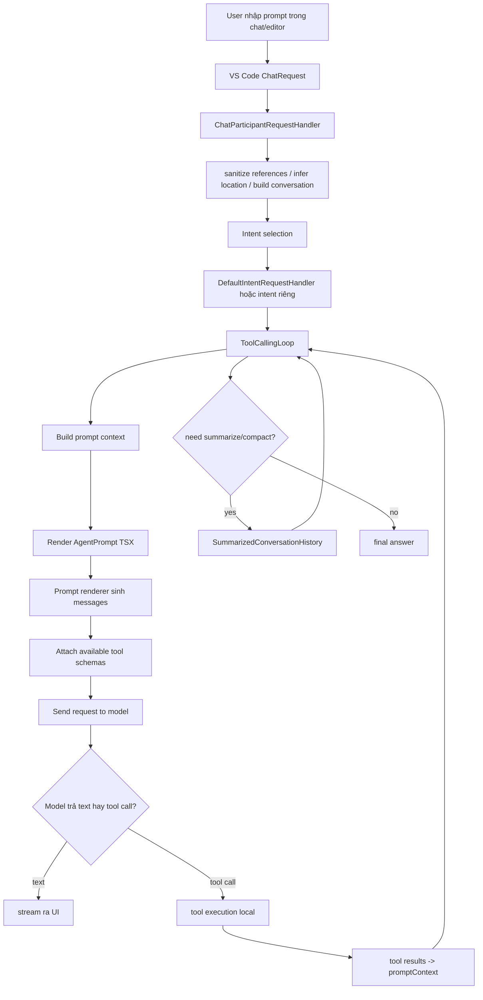

### 45.2 Bước 1: user input ban đầu là gì

Nguồn input có thể gồm:

- text prompt
- slash command / command intent
- references/attachments
- active editor / notebook / selection context
- mode instructions nếu user đang chạy custom agent/mode
- tool references
- accepted confirmations / permission state

Trong code, request đi vào handler qua `ChatRequest` và `rawHistory`:

- [chatParticipantRequestHandler.ts](/d:/Personal/Projects/vscode-copilot-chat/src/extension/prompt/node/chatParticipantRequestHandler.ts)

### 45.3 Bước 2: request không được gửi thẳng lên model

Handler làm vài việc trước:

- xác định `location`:
  - panel
  - editor
  - notebook
  - terminal
- sanitize variables/references theo ignore rules
- build `Conversation` từ `rawHistory`
- tạo `Turn` mới cho request hiện tại
- suy luận `documentContext`
- chuẩn bị telemetry context

Điểm quan trọng:

- dữ liệu UI/raw request chưa phải prompt cuối
- prompt cuối chỉ được sinh sau khi intent và tool loop quyết định xong

### 45.4 Bước 3: quyết định intent nào xử lý request

Tại đây hệ thống chọn:

- intent chuyên biệt
- hoặc default intent handler

Quyết định dựa trên:

- slash command / explicit participant
- command registry
- intent detection
- request location
- references và document context

Điểm cần dạy lại cho team:

- "quyết định làm gì" phần lớn xảy ra trước khi model chính bắt đầu chạy vòng agent
- nhưng "quyết định tool cụ thể nào sẽ được gọi trong từng bước" thường vẫn do model quyết định trong tool-calling loop

### 45.5 Bước 4: ToolCallingLoop tạo `promptContext`

Đây là chỗ rất quan trọng vì nó là cầu nối giữa state nội bộ và prompt cuối.

`promptContext` thường chứa các nhóm dữ liệu như:

- `query`
- `history`
- `conversation`
- `chatVariables`
- `tools.availableTools`
- `tools.toolInvocationToken`
- `toolCallRounds`
- `toolCallResults`
- `modeInstructions`
- request metadata khác phục vụ render

Nhưng không phải mọi field đều đi nguyên xi lên model.

### 45.6 Bước 5: AgentPrompt chọn các khối nào sẽ được render

Trong:

- [agentPrompt.tsx](/d:/Personal/Projects/vscode-copilot-chat/src/extension/prompts/node/agent/agentPrompt.tsx)

`AgentPrompt.render()` build prompt theo các khối chính:

1. base system instructions
2. custom instructions
3. global agent context
4. conversation history hoặc summarized history
5. user message hiện tại
6. tool call transcript / tool results

Nói cách khác:

- state nội bộ -> prompt components
- prompt components -> rendered `messages`

### 45.7 Bước 6: base instructions được ráp như thế nào

`baseInstructions` gồm:

- system message nhận diện assistant + safety + identity rules
- system prompt class theo model family
- memory instructions
- custom instructions
- autopilot completion rule nếu bật autopilot
- global agent context dưới dạng user message

Ý nghĩa thực tế:

- không phải chỉ có "system prompt" là quan trọng
- có cả các user/system blocks phụ trợ được nhét thêm trong prompt assembly

### 45.8 Bước 7: custom instructions vào prompt theo cách nào

`getAgentCustomInstructions()` có thể lấy custom instructions và render:

- vào `SystemMessage`
- hoặc vào `UserMessage`

tuỳ config `CustomInstructionsInSystemMessage`.

Ngoài ra nếu request có `modeInstructions` thì nó render thêm block:

- `"You are currently running in <name> mode ..."`

và block đó được ghi rõ là:

- phải ưu tiên hơn các instructions phía trên

Điểm rất quan trọng cho team:

- `.github/copilot-instructions.md` không phải luôn luôn là "một file đứng ngoài prompt"
- nó được đọc, resolve, rồi chèn vào prompt như content thực tế
- cùng loại cơ chế áp dụng cho các instruction files khác

### 45.9 Bước 8: global agent context là gì

Global context là phần "tĩnh tương đối" ở đầu cuộc hội thoại, ví dụ:

- OS / environment info
- workspace structure ban đầu
- session resource
- các hint nền khác hữu ích cho toàn thread

Nó được cache bằng metadata trên first turn nếu cache key còn khớp.

Hệ quả:

- có những dữ liệu không cần render lại mỗi turn
- nhưng vẫn có thể được tái sử dụng như context nền

### 45.10 Bước 9: history nào được đưa vào model

Không phải cứ full raw history là được nhét thẳng lên model.

Nếu bật cache breakpoints / summarization path:

- dùng `SummarizedConversationHistory`

Nếu không:

- dùng `AgentConversationHistory`

Rồi tới:

- `AgentUserMessage`
- `ChatToolCalls`

Vì vậy history thật sự lên model là:

- history đã qua normalize
- có thể đã qua summarize
- có thể đã rút gọn tool outputs
- có thể đã cache hóa global context

### 45.11 Bước 10: tool schemas được gửi khi nào

Khi prompt render xong, request cuối gửi lên endpoint không chỉ có messages mà còn có:

- danh sách tool schemas khả dụng cho lượt đó

Tool nào được xuất hiện phụ thuộc vào:

- code gating
- location/mode
- permission level
- endpoint/tool support
- registry/runtime filtering

Model không "tự phát minh" tool mới.

Model chỉ có thể:

- chọn trong tập tools được cấp cho vòng hiện tại
- hoặc không gọi tool nào

### 45.12 Bước 11: model quyết định gì, code quyết định gì

Phân lớp rất rõ như sau:

Code quyết định:

- request nào đi vào flow nào
- có những tools nào được exposed
- prompt skeleton gồm những khối nào
- có summarize hay không
- cắt/truncate tool outputs ra sao
- permission / confirmation flow

Model quyết định:

- có cần research thêm không
- có gọi tool hay không
- gọi tool nào trong tập được cấp
- gọi bao nhiêu vòng
- trả lời text ra sao
- khi nào xem như xong task

### 45.13 Bước 12: tool results quay trở lại prompt thế nào

Sau mỗi vòng tool call:

- tool được execute local
- result được lưu vào `toolCallResults`
- transcript được lưu trong `toolCallRounds`
- prompt được rebuild cho vòng tiếp

Điều này cực quan trọng:

- model lượt sau không "nhớ" tool result bằng ma thuật
- nó thấy tool result vì extension render lại result đó vào prompt kế tiếp

### 45.14 Bước 13: summarize/compact xảy ra khi nào

Với agent flow dài:

- conversation có thể bị summarize
- global context có thể được cache
- history dài được nén thành summary blocks

Mục tiêu:

- giữ signal quan trọng
- giảm chi phí context
- vẫn duy trì continuity cho thread dài

Nói ngắn gọn:

- compact không có nghĩa là mất sạch lịch sử
- nó là biến raw history thành representation rẻ hơn và có ích hơn cho lượt sau

### 45.15 Bước 14: cái gì KHÔNG nhất thiết được gửi nguyên văn lên LLM

Rất nhiều thứ tồn tại trong local state nhưng không đi nguyên xi lên model:

- toàn bộ object graph của services
- raw telemetry builder state
- toàn bộ workspace theo dạng file-by-file nếu chưa được resolve
- mọi file trong `.github/`
- mọi open tab
- mọi tool result gốc nếu bị truncate/tóm tắt
- toàn bộ raw history nếu đã summarize

Đây là chỗ nhiều người hay hiểu sai.

Extension không "upload nguyên IDE state".

Nó:

- chọn lọc
- render
- nén
- rồi mới gửi

### 45.16 Bước 15: công thức tinh gọn để giải thích cho engineer khác

Có thể dạy bằng câu này:

> User input + selected context + instructions + summarized history + tool transcript + available tool schemas
> -> render thành model request cho turn hiện tại.

Hoặc ngắn hơn:

> Không phải "mọi thứ trong IDE" được gửi lên model.
> Chỉ những gì extension chọn, render và giữ lại sau compaction mới đi lên model.

---

## 46. Gợi ý thực chiến: làm sao để user làm việc tốt hơn với VS Code Copilot Chat

Phần này là guidance thực hành. Nó không phải luật cứng của codebase, mà là recommendation tổng hợp từ:

- cách extension assemble context
- cách tool loop vận hành
- và một phần insight workflow trong [meeting.txt](/d:/Personal/Projects/vscode-copilot-chat/docs/meeting.txt)

### 46.1 Đừng cố nhét hết context ngay từ đầu

Vì agent có khả năng research codebase, prompt tốt hơn thường là:

- nêu outcome
- nêu 1-2 anchor files/modules
- nêu constraint
- nêu cách verify

Không cần:

- dump 20 file
- paste toàn bộ README dài
- paste cả đống ghi chú cũ không còn liên quan

### 46.2 Chỉ đưa source-of-truth và hard constraints

Context rất mạnh khi nó là một trong các loại sau:

- source-of-truth file
- acceptance criteria
- repro steps
- stack trace
- test command / verification command
- architectural constraint
- non-goals

Context yếu và gây nhiễu khi nó là:

- suy đoán mơ hồ
- brainstorming cũ
- file "có thể liên quan"
- conventions không chính thức

### 46.3 Đưa context ở đúng lớp

Một nguyên tắc rất mạnh:

- cái gì lặp đi lặp lại nhiều task -> đưa vào instruction/common docs
- cái gì chỉ đúng cho 1 task -> đưa trong prompt hiện tại
- cái gì chỉ phục vụ kiểm chứng -> đưa trong verify section

### 46.4 Thread nên được giữ theo feature/subproblem, không phải theo ngày

Từ góc nhìn compaction:

- một thread dài nhưng cùng chủ đề thường vẫn hữu ích
- một thread bị nhảy topic liên tục sẽ làm summary kém sắc nét hơn

Practical rule:

- cùng feature/subsystem -> tiếp tục thread
- khác domain/problem rõ rệt -> mở thread mới

### 46.5 Plan mode / docs tạm thời chỉ nên dùng khi task lớn hoặc mơ hồ

Không phải task nào cũng cần plan mode.

Plan mode hoặc markdown decision log hữu ích khi:

- task lớn
- nhiều bước phụ thuộc nhau
- nhiều người/agent cùng làm
- cần giữ decision log
- scope đang còn mơ hồ

Task nhỏ hoặc fix rõ ràng:

- thường prompt trực tiếp tốt hơn

### 46.6 Muốn agent tốt dần theo thời gian thì đừng nhắc tay mãi

Nếu thấy cùng một lỗi lặp lại:

- thêm common doc
- thêm instruction file
- thêm skill
- hoặc cập nhật `copilot-instructions.md`

Đây là cách chuyển "prompt lặp lại" thành "repo memory".

### 46.7 Prompt tốt cho agent thường có 4 mảnh

Mẫu nên ưu tiên:

```text
Goal:
Fix/implement <kết quả mong muốn>.

Start here:
Look at <file/module>.

Constraints:
Do not change <x>. Keep <y> behavior.

Verify:
Run/check <command or observable behavior>.
```

### 46.8 Khi nào nên attach file, khi nào chỉ mention path

Attach/paste khi:

- error output ngắn và chính xác
- snippet source-of-truth ngắn
- acceptance criteria nhỏ

Chỉ mention path khi:

- file dài
- agent có thể tự đọc
- mục tiêu là cho agent anchor để research

### 46.9 Context tối ưu cho team nên có hình dạng gì

Một repo "thân thiện với agent" thường có:

1. `copilot-instructions.md` cho rules toàn repo
2. docs giải thích architecture theo subsystem
3. docs chỉ rõ source-of-truth
4. docs verification/test commands
5. docs common failure modes
6. skills/prompts cho workflows lặp lại

### 46.10 Anti-patterns phổ biến

- prompt dài nhưng không nói outcome
- nêu quá nhiều file nhưng không chỉ file anchor
- đưa conventions mâu thuẫn với repo
- yêu cầu "fix đi" nhưng không có repro/verify
- trộn nhiều task không liên quan trong cùng thread
- nhét cả decision log cũ vào mọi prompt

### 46.11 Một heuristic rất dễ nhớ

Trước khi gửi prompt, tự hỏi:

1. Agent cần biết gì để quyết định đúng?
2. Agent cần file nào để bắt đầu đúng chỗ?
3. Agent bị cấm làm gì?
4. Agent sẽ tự verify bằng cách nào?

Nếu trả lời được 4 câu này, prompt thường đã đủ mạnh.
