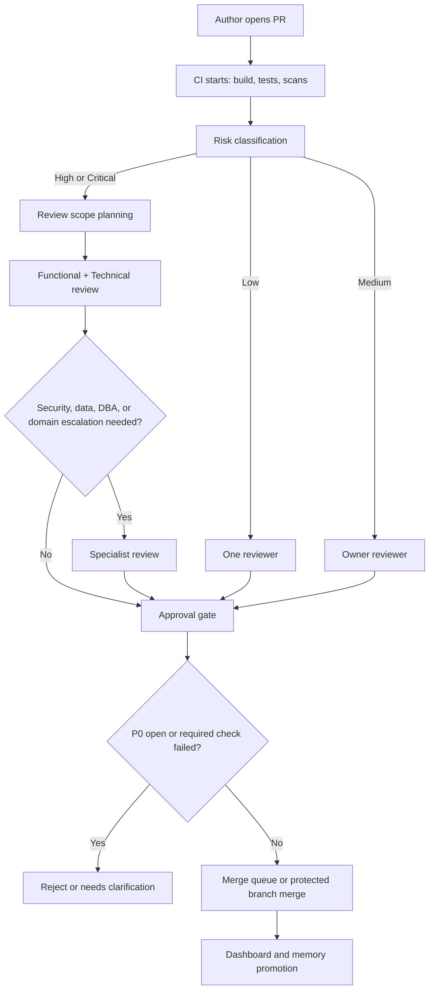

# Java Finance Review Support System

This document defines an operating model for code review support in Java
enterprise finance projects. It complements the core review playbook and the
finance-specific checklist pack:

- `docs/reviews/checklists/functional-core.md`
- `docs/reviews/checklists/technical-core.md`
- `docs/reviews/checklists/java-finance-enterprise.md`
- `.github/docs/review-playbook.md`

## Goals

- Route each PR to the right review depth based on risk, not changed line count.
- Separate functional/domain review from technical production-readiness review.
- Make evidence mandatory for high-risk decisions.
- Move mechanical checks to CI so human reviewers focus on semantic risk.
- Promote repeated accepted review lessons back into durable repo memory.

## Five-Layer Model

| Layer | Purpose | Primary owners |
|---|---|---|
| Policy | Risk taxonomy, checklist packs, approval matrix, waiver rules | Engineering governance, AppSec, domain leads |
| Triage | Risk tagging, scope planning, reviewer routing | Bot/assistant, PR author, tech lead |
| Human review | Functional, technical, security/data, migration review | Reviewer pool and code owners |
| Automation | Build, tests, coverage, SAST/SCA, SBOM, quality gates | DevEx and CI platform owners |
| Learning | Review memory, checklist promotion, dashboard, debt backlog | Tech lead and checklist steward |

## Review Lanes

| Lane | Main question | Typical checks |
|---|---|---|
| Functional | Does the code solve the intended business problem? | AC traceability, money rules, state transitions, cross-domain side effects |
| Technical | Is the code safe and production-ready? | Compatibility, transaction integrity, concurrency, migrations, performance, boundaries |
| Security/Data | Does the change protect access, secrets, and regulated data? | Authz, injection, masking, audit trail, dependency/security findings |
| Automation | Did objective quality gates pass? | Build, unit/integration tests, coverage, mutation, SAST, SCA, SBOM, SARIF/Sonar |

## Risk-Based Flow



## Approval Matrix

| Trigger | Required reviewers |
|---|---|
| Local refactor, documentation, or test-only change | One reviewer |
| Local service/repository change with no shared contract | One owning reviewer |
| Business rule, state transition, money flow, or domain workflow | One technical reviewer and one functional/domain reviewer |
| Shared DTO, shared library, public API, event schema, or migration | Code owner and one senior technical reviewer |
| Payment, pricing, ledger, reconciliation, authorization, PII, token, secret, crypto, or internet-facing dependency | Code owner, senior technical reviewer, and security/data reviewer |
| Emergency hotfix in regulated or money-moving flow | Above plus release owner or incident lead |

## Merge Rules

- Every PR has an explicit risk class: Low, Medium, High, or Critical.
- High/Critical PRs require a scope plan before deep review.
- High/Critical PRs require a structured review report.
- P0 findings block merge unless a formal waiver is approved by the accountable owner.
- New code quality gates must pass before merge.
- Code-owner approval is required for shared contracts, migrations, security-sensitive code, and regulated finance flows.
- Stale approvals should be dismissed after reviewable pushes on High/Critical PRs.
- Exceptions must produce a follow-up ticket with owner, deadline, and risk acceptance note.

## CI Gate Baseline

| Gate | Baseline |
|---|---|
| Build | `mvn -B verify` or the project-equivalent build must pass |
| Unit tests | All unit tests pass |
| Integration tests | Required when integration, migration, persistence, external client, or transaction behavior changed |
| Coverage | New code coverage at least 80%; finance-critical paths target stronger branch coverage |
| Mutation | Recommended for payment, pricing, ledger, authorization, and reconciliation modules |
| Static analysis | No new blocker/critical findings from configured analyzers |
| SAST/secrets | No untriaged high-severity security or secret findings |
| SCA/dependencies | No unwaived high/critical vulnerabilities in new or changed dependencies |
| Quality gate | Sonar or equivalent new-code gate passes when configured |
| SBOM | Required artifact for release branches or regulated services |

## Structured Review Report

Use this shape for High/Critical PRs and for Medium PRs with unclear context.

```markdown
## Review Summary

### Risk class
- Low / Medium / High / Critical

### Review lanes applied
- Functional
- Technical
- Security/Data
- Migration
- Observability

### Verdict
- PASS / REJECT / NEEDS CLARIFICATION

### Business traceability
| AC / Rule | Code location | Test location | Status |
|---|---|---|---|

### Technical findings
| Severity | Category | File:Line | Problem | Why it matters | Suggested fix |
|---|---|---|---|---|---|

### Mandatory evidence checked
- [ ] Money math
- [ ] Authorization
- [ ] Transaction integrity and idempotency
- [ ] Audit trail and sensitive data masking
- [ ] API or schema compatibility
- [ ] Migration safety
- [ ] Dependency/security scan
- [ ] Test scenarios
- [ ] Observability
- [ ] Rollback or compensation path

### Merge decision
- Conditions to merge:
- Follow-up tickets:
```

## Reviewer Handoff Template

```markdown
## Review handoff

- Risk class:
- Reason for escalation:
- Files fully read:
- Callers/dependents inspected:
- Business rules or ACs checked:
- Red flags found:
- Still needs verification:
- Checklist packs applied:
```

## Waiver Policy

Waivers are not a substitute for review. Use them only when the risk is
understood, bounded, and owned.

Every waiver must include:

- Finding ID or category.
- Risk class and affected production surface.
- Reason the fix cannot be completed before merge.
- Compensating control or monitoring.
- Owner and expiration date.
- Follow-up ticket.
- Approval from the accountable technical and domain/security owner.

Waivers are not allowed for unreviewed secrets, unbounded authorization bypass,
known injection surfaces, or unknown production blast radius.

## Operating Metrics

| Metric | Purpose |
|---|---|
| Time to first review | Measures reviewer responsiveness |
| Review completion time | Measures delivery flow |
| High/Critical PRs with structured reports | Measures process compliance |
| P0/P1 escape rate | Measures review effectiveness |
| Post-merge rollback or hotfix rate | Measures production quality |
| New-code coverage pass rate | Measures test gate reliability |
| Mutation pass rate for critical modules | Measures test strength |
| Security findings triaged before merge | Measures AppSec integration |
| JUnit Jupiter ratio for new tests | Measures test modernization |
| Accepted findings promoted to checklist/memory | Measures learning loop |

## Reviewer Onboarding

New reviewers should complete these tasks before independently reviewing
Medium or High risk PRs:

- Read the review playbook and this operating model.
- Understand risk classes and escalation triggers.
- Shadow at least five PR reviews with a senior reviewer.
- Learn the P0 finance checks: money, authorization, transaction integrity, auditability, sensitive data, concurrency, compatibility.
- Run the local build, tests, and configured scans.
- Read examples of JaCoCo, mutation, SAST/SCA, and quality-gate reports.
- Practice writing blocker/warning comments with a concrete fix and verification step.
- Learn when to escalate instead of extending a long review thread.

## One-Page Cheat Sheet

| If you see | Ask | Default decision |
|---|---|---|
| `double` or `float` in money logic | Where are scale and rounding defined? | Block |
| External call inside write transaction | How are timeout, retry, rollback, and idempotency handled? | Block |
| Query string concatenation | Why is this not parameterized? | Block |
| Concurrent entity write with no version/locking | How are stale updates prevented? | Block |
| Token, account, PAN/card, password, or secret in logs | Where is redaction enforced and tested? | Block |
| DTO/API/status/error change | Which consumers are affected and what is the compatibility plan? | Block or warning |
| Java 11 build using removed Java EE APIs without dependencies | Where are replacement dependencies declared? | Block |
| Test only covers happy path | Which negative, boundary, and failure paths prove the change? | Warning |
| Refactor mixed with behavior change | Can this be split or clearly isolated? | Warning |

